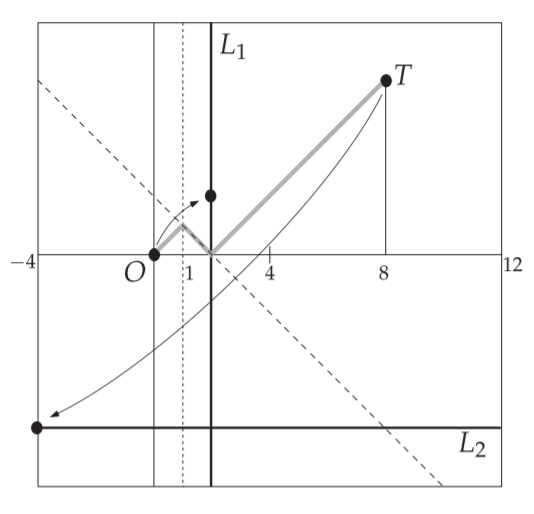

# 用折纸解三次方程

## 折纸公理6(双点到线)

折纸公理6是欧氏几何所没有的，折纸操作与欧氏几何相比其最大的魅力就在于折叠过程借用了三维空间。也就是说，欧氏几何作图是在刚性的平面上用直尺和圆规来完成的，而在折纸操作中虽然不用任何作图工具，但折叠过程移动了"平面"


已知两点和两条相交线，可以将其中一点折到一条直线上且同时让另一点落在另一条直线上。设 $l_1$ 与$ l_2 $为两条相交直线，$P1$、$P2$为两个已知点， 将$ P_1 $折到直线$l_1$上同时让$P2 $落到$ l_2 $， 记为 $P_1 → l_1 ∧ P_2 → l_2$，记 P1 的落点为$ Q_1$，$P_2$的落点为 $Q_2$， 折痕为$m$

### 性质

由折叠的对称性可知$P_{1} Q_{2}=Q_{1} P_{2}$

所以$P_{1} Q_{1} P_{2}Q_{2}$为等腰梯形

所以关于同一折痕的两对对应点的连线是等腰梯形

### 特殊性

折纸公理6是欧氏几何所没有的，折纸操作与欧氏几何相比其最大的魅力就在于折叠过程借用了三维空间。也就是说，欧氏几何作图是在刚性的平面上用直尺和圆规来完成的，而在折纸操作中虽然不用任何作图工具，但折叠过程移动了"平面"

## 方法的构造

试想一下，我们要解下面的三次方程式，求一个实根

$ax^{3}+b x^{2}+c x+d=0$


我们从原点$O$开始沿$x$轴正方向画一条长为$a$的线段，然后逆时针旋转$90^\circ$，向上延伸长度$b$，重复，逆时针旋转$90^\circ$，延伸长度$c$，然后再旋转$90^\circ$延伸长度$d$最后停留在点$T$

注意如果系数为负，仍要逆时针旋转$90^\circ$再延伸负长度，即方向相反。如果系数为$0$就原地旋转，但不要往前延伸

我们可以编程实现系数的构建

```c++
#include<bits/stdc++.h>
using namespace std;

int dir[4][2] = { 1,0,0,1,-1,0,0,-1 };//旋转向量
int var[4] = { 1,0,-7,-6 };//三次方程的系数
int point[2] = { 0,0 };//点目前的坐标

int main() {
	for (int i = 0; i < 4; i++) {
		point[0] = point[0] + var[i] * dir[i][0];//点的x坐标
		point[1] = point[1] + var[i] * dir[i][1];//点的y坐标
		cout << point[0]<<','<< point[1] <<endl;
	}
}
```

运行结果


### 求解

想象我们站在原点$O$射出一颗子弹，经过两边反射，最后击中点$T$

方法所描述的是，如果我们从点$O$开始，以角度$\theta$方向沿着子弹路径出发，成功的射中点$T$，那么$x=-\tan \theta$将是我们三次方程的一个根

实际上方法是一种通用的几何构造，他使人们可以找到任何一元多次方程的实根。它是由一名叫Eduard的奥地利工程师在十九世纪发现的，在折纸中能用它来解决一元三元方程的事实是由意大利数学家Margherita在20世纪30年代发现的

### 正确性


由图中三个三角形都相似可得

$ { \angle p_1 O q _ { 1 } = \angle p _ { 2 } q _ { 1 } q _ { 2 } = \angle p _ { 3 } q _ { 2 } T = \theta } $

首先观察$\triangle O p_{1} q_{1}$

$ { \tan \theta = \frac { q _ { 1 } A } { a } \Rightarrow q _ { 1 } p _ { 1 } = a \tan \theta } $

$ { p _ { 2 } q _ { 1 } = p _ { 2 } p _ { 1 } - p _ { 1 } q _ { 1 } = b - a \tan \theta } $

然后观察$\triangle q_{1} p_{2} q_{2}$

$ { \tan \theta = \frac { q_2 p _ { 2 } } { p _ { 2 } q _ { 1 } } \Rightarrow q _ { 2 } p _ { 2 } = \tan \theta \cdot p _ { 2 } q _ { 1 } = b \cdot \tan \theta - a \tan ^ { 2 } \theta } $

$ { p _ { 3 } q _ { 2 } = p _ { 3 } p _ { 2 } - q _ { 2 } p _ { 2 } = c - b \cdot \tan \theta + a \cdot \tan ^ { 2 } \theta } $

最后观察$\triangle q_{2} p_{3} T$

$d = p _ { 3 } q _ { 2 } \cdot \tan \theta = c \tan \theta - b \tan ^ { 2 } \theta + a \tan ^ { 3 } \theta$

$a ( - \tan \theta ) ^ { 3 } + b ( -\tan \theta ) ^ { 2 } + c ( -\tan \theta ) + d = 0$

所以$x=- \tan \theta$是方程$ax^{3}+b x^{2}+c x+d=0$的解

如果系数为负数那怎么办呢？

对于$a x^{3}+b x^{2}-c x+d=0$

我们可以画出下面的图像


现在证明$x=-\tan \theta$也是方程的解

$\operatorname{In} \triangle O p_{1} q_{1},-x=\tan \theta=\frac{p_{1} q_{1}}{a}=\frac{b+q_{1} p_{2}}{a}$

$\Rightarrow q_{1} p_{2}=-a x-b$

$\text { In } \triangle q_{1} p_{2} q_{2},-x=\tan \theta=\frac{p_{2} q_{2}}{q_{1} p_{2}}=\frac{c+p_{3} q_{2}}{-a x-b}$

$\Rightarrow p_{3} q_{2}=-x(-a x-b)-c$

$\operatorname{In} \triangle q_{2} p_{3} T,-x=\tan \theta=\frac{d}{p_{3} q_{2}}=\frac{d}{-x(-a x-b)-c}$

$\Rightarrow-a x^{3}-b x^{2}+c x=d $

$\Rightarrow a x^{3}+b x^{2}-c x+d=0 $

证明完毕

## 使用GeoGebra模拟


$x=-1$


$x=-2$


$x=3$

## 使用折纸解决


第一步前进$a$的同时再前进$a$，折出$L_1$；最后一步前进$d$的同时后退$d$，折出$L_2$


因为${Op_1}={q_1p'}=a$

易得$\triangle{Op_1q_1} \cong \triangle{q_1p'O'}$

故${q_1q_2}$垂直平分${OO'}$，即$\angle Oq_1q_2=\frac \pi 2$

$\because {Oq_1}\;/\kern -0.8em /\;{Tq_2}$

$\therefore \angle Tq_2q_1=\frac \pi 2$

所以$x=-  p_1q_1/Op_1$为方程的解

### 示意图


构造参数



$x=-1$


$x=-2$


$x=3$

方法还可以用来解五次方程，如下图


