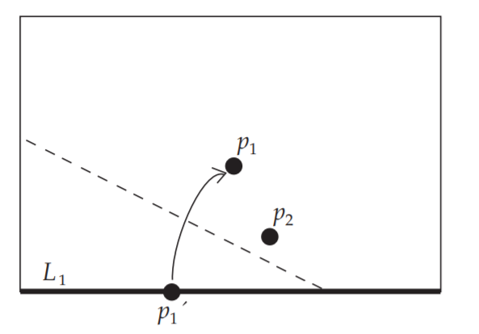
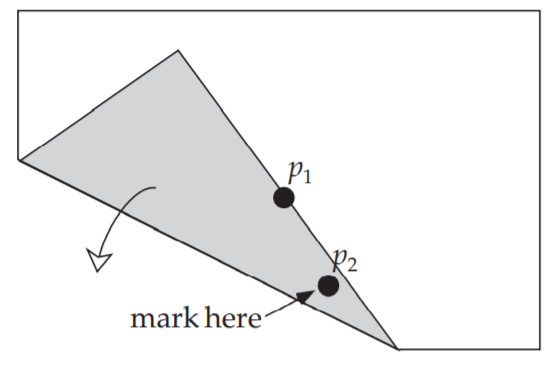
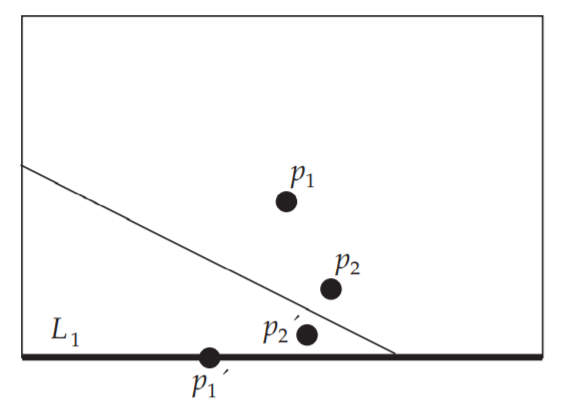
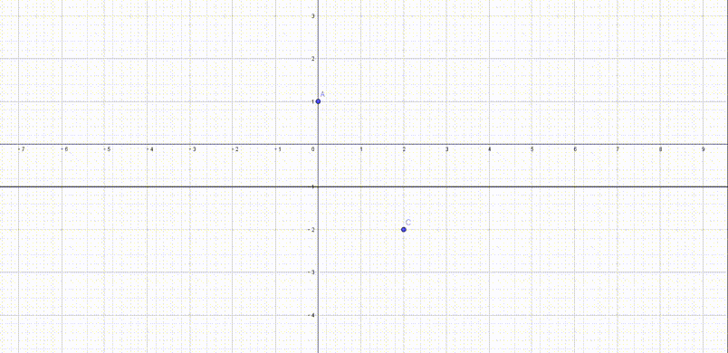
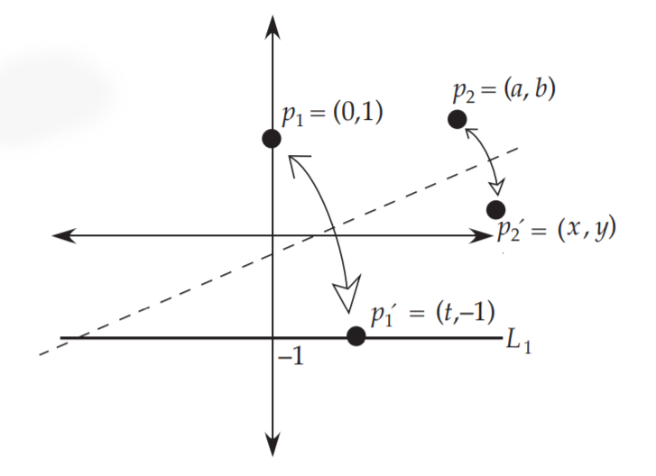
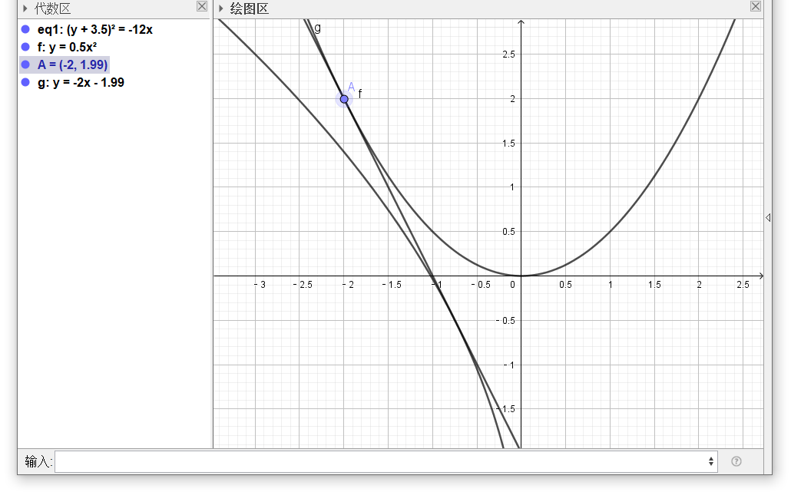
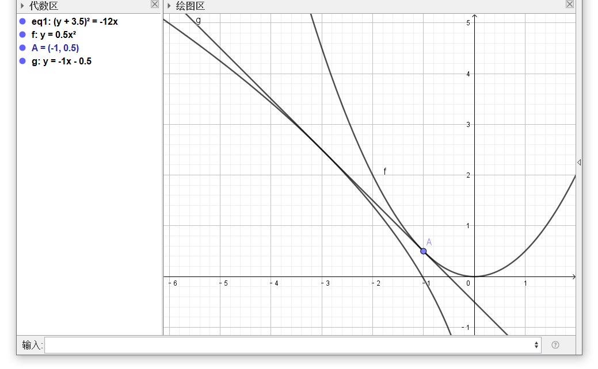
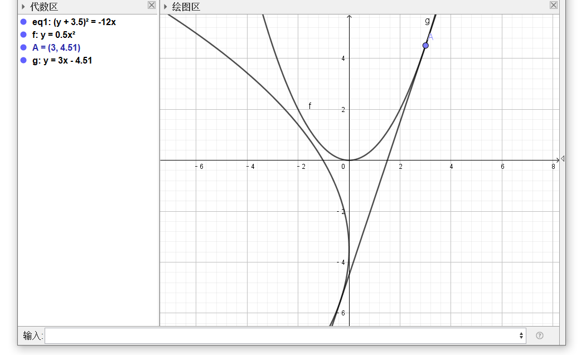

# 折叠三次曲线

取一张纸，选取一个定点$p_1$并在纸的下边上任选一点$p_1^ { \prime }$

折叠，使$p_1$和$p_1^ { \prime }$重合，标注$p_2$所对应的位置

展开，便得到了$p_2$关于折线的对称点$p_2^ { \prime }$

我们可以借助$GeoGebra$去研究$p_2'$的轨迹

看起来很有意思，那么这个轨迹的方程是什么呢？

## 分析

像抛物线折叠建立坐标系

折线的方程和抛物线折叠一模一样，为

${ y = \frac { t } { 2 } x - \frac { t ^ { 2 } } { 4 } }$

又$ p p _ { 1 } ^ { \prime }$和$p _ { 2 } p _ { 2 } ^ { \prime }$都垂直于折线，所以

$ { k _ { p p _ { 1 } ^ { \prime } } = k _ { p _ { 2 } p _ { 2 } ^ { \prime } } } $

$ { \frac { - 1 - 1 } { t } = \frac { y - b } { x - a } \Rightarrow - \frac { 2 } { t } = \frac { y - b } { x - a } } $

解出$t$

$ { t = - \frac { 2 ( x - a ) } { y - b } = \frac { 2 ( a - x ) } { y - b } } $

设$p_2^{\prime}$坐标为$(x,y)$，则$p _ { 2 } p _ { 2 } ^ { \prime }$中点坐标为

$ { ( \frac { x + a } { 2 } , \frac { y + b } { 2 } ) } $

因为这两点关于折线对称，故中点在折线上，带入得

$ { \frac { a - x } { y - b } \cdot ( \frac { x + a } { 2 } ) - ( \frac { a - x } { y - b } ) ^ { 2 } = \frac { y + b } { 2 } } $

化简得

$ { ( a ^ { 2 } - x ^ { 2 } ) \cdot ( y - b ) - 2 ( a - x ) ^ { 2 } = ( y + b ) ( y - b ) ^ { 2 } } $

$ y ^ { 3 } + x ^ { 2 } y - b y ^ { 2 } + ( 2 - b )  x ^ { 2 } - b y ^ { 2 } - 4 a x - ( a ^ { 2 } + b ^ { 2 } )  y  + a ^ { 2 } b + 2 a ^ { 2 } + b ^ { 3 } = 0$

这显然是一个三次曲线的方程

## 斜率与三次方程的解

对任意三次方程$x^{3}+a x^{2}+b x+c=0$，我们可以令$z=x-\frac{1}{3}  a$，于是方程便转换为

$z^{3}+\frac{3 b-a^{2}}{3} z-\frac{9 a b-27 c-2 a^{3}}{27}=0$

从而从$x^{3}+a x^{2}+b x+c=0$转化到了$x^{3}+ ax+b=0$

考虑两条抛物线

$l_1:\,\left(y-\frac{1}{2} a\right)^{2}=2 bx \quad  and \quad l_2:\,y=\frac{1}{2} x^{2}$

设$\ell$为这两个抛物线的共同切线，斜率为$m$，且与$l_1$相切与$\left(x_{1}, y_{1}\right)$，与$l_2$相切与$\left(x_{2}, y_{2}\right)$

对$l_1$两边同时求导

$ { y ^ { 2 } - a y + \frac { 1 } { 4 } a ^ { 2 } = 2 b x } $

$ { 2 y \cdot \frac{\mathrm{d} y}{\mathrm{d} x}  - a \frac{\mathrm{d} y}{\mathrm{d} x}  + 0 = 2 b } $

整理得

$ { \frac{\mathrm{d} y}{\mathrm{d} x}  = \frac { 2 b } { 2 y - a } = \frac { b } { y - \frac { 1 } { 2 } a } } $

带入$y_1$

$y_{1}-\frac{1}{2} a=\frac{b}{m}$

所以我们可以用$m$表示$x_1$和$y_1$

$x_{1}=\frac{\left(y_{1}-\frac{1}{2} a\right)^{2}}{2 b}=\frac{\left(\frac{b}{m}\right)^{2}}{2 b}=\frac{b}{2 m^{2}}$

$y_{1}=\frac{b}{m}+\frac{a}{2}$

同理，对$l_2$求导得

$x_{2}=m$

$y_{2}=\frac{m^{2}}{2}$

我们知道，过$\left(x_{1}, y_{1}\right)$和$\left(x_{2}, y_{2}\right)$的直线斜率为

$m=\frac{y_{2}-y_{1}}{x_{2}-x_{1}}$

带入得

$m=\frac{y_{2}-y_{1}}{x_{2}-x_{1}}=\frac{\frac{m^{2}}{2}-\left(\frac{b}{m}+\frac{a}{2}\right)}{m-\frac{b}{2 m^{2}}}=\frac{m^{4}-2 b m-a m^{2}}{2 m^{3}-b}$

即

$m^{3}+a m+b=0$

说明$m$为方程$x^{3}+ ax+b=0$的解

尝试求解$x^3-7x-6=0$，先构造两个抛物线

注意$g$的斜率

$x=-2$

$x=-1$

$x=3$

于是我们便获得了这个三次方程的三个解$x=-2,-1,3$

那么，怎么用折纸的方法构造呢？

容易看出，$l_1$的焦点为$(\frac b 2,\frac a 2)$，准线为$x=-\frac b 2$，$l_2$的焦点为$(0,\frac{1}{2})$，准线为$y=-\frac{1}{2}$

根据上一节的抛物线折叠的性质，我们同时分别将点$(\frac b 2,\frac a 2)$折到$x=-\frac b 2$上，将点$(0,\frac{1}{2})$折到$y=-\frac{1}{2}$上，所形成的折现即为两条抛物线的共同切线，至于为什么可以做到，我们将在下一节讨论折纸公理六时详细阐述。

三次函数

$$
f(x) = a{x^3} + b{x^2} + cx + d(a \ne 0)\\f'(x) = 3a{x^2} + 2bx + c\\\Delta  = 4{b^2} - 12ac = 4({b^2} - 3ac)
$$
拐点
$$
P\left( { - \frac{b}{{3a}},f\left( { - \frac{b}{{3a}}} \right)} \right)
$$

$$
方程\sum\limits_{i = 0}^n {a_i}{x^i}  = 0 的根为  x_{1}, x_{2}, \cdots, x_{n}  \\

x_{1}+x_{2}+\cdots+x_{n}=\sum_{i=1}^{n} x_{i}=-\frac{a_{n-1}}{a_{n}} \\
x_{1} x_{2} \cdots x_{n}=\prod_{i=1}^{n} x_{i}=(-1)^{n} \frac{a_{0}}{a_{n}}
$$
