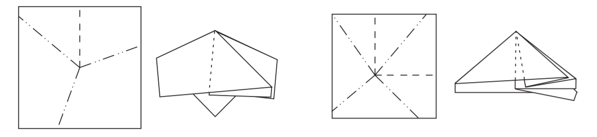

## 前川定理(The Maekawa-Justin Theorem)

## 简介

MAEKAWA Jun (前川淳)，日本的软件工程师，数学家，折纸艺术家。

平顶点折叠的例子

让$M(\text{Mountain})$和$V(\text{Valley})$分别代表平顶点折叠中山折和谷折的数量，则前川定理可以表示为

$M = V +2 \quad \text{or}\quad V = M + 2$

即$|M-V|=2$

$\text{Proof}\;1:$

由于我们只关心顶点$x$和周围的折痕，所以可以以$x$为圆心做一个圆$(a)$，按折痕折叠后形成$(b)$

从下往上看向顶点x，可以发现圆环形成了一个闭合回路$(c)$

想象有一个蚂蚁从$p$点出发在这个闭合回路上爬行，遇到山折便逆时针旋转$180^{\circ}$，遇到谷折便顺时针旋转$180^{\circ}$，最后回到原点，方向和开始一样，由于沿着闭合回路走了一周，相当于旋转了$360^{\circ}$度，即

$M · 180^{\circ} +V ·(−180^{\circ}) = 360^{\circ}$

$M − V = 2$

因为纸有两面，如果从另一面看，原来的山折变成了谷折，原来的谷折变成了山折，所以有

$V − M = 2$

这样便证明了前川定理

$\text{Proof}\;2:$

这个证明是由$\text{Jan Siwanowicz}$在他还是个高中生的时候提出的

将此前的闭合回路看作一个多边形，把山折看成内角等于$0$，谷折看成内角等于$360^{\circ}$

由多边形内角和定理

$\sum\limits_{i=1}^n\theta_i=(n-2)×180^{\circ}$

推得在这个多边形中，内角和为

$M · 0^{\circ} +V · 360^{\circ}$

所以$V · 360^{\circ} = (M +V-2)180^{\circ}$

$\therefore M = V +2 \quad \text{or}\quad V = M + 2$

### 推广：

$M + V = 2(V+1) \quad \text{or} \quad2(V − 1)$

得到偶数定理：单顶点折叠中折痕总数必为偶数，角的总数也必为偶数