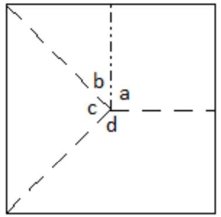
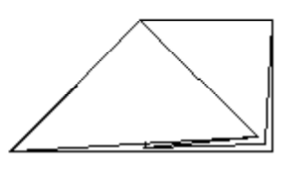
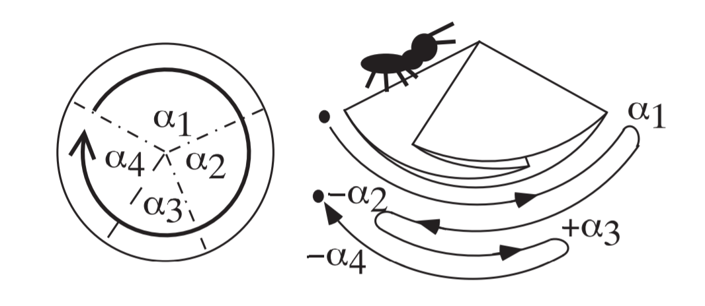
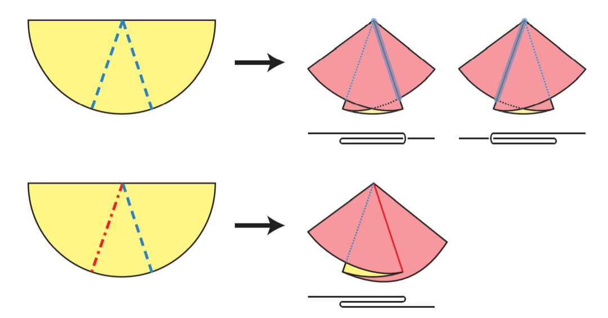

## 川崎定理(The Kawasaki-Justin Theorem)

$a=90^{\circ}, b=45^{\circ}, c=90^{\circ}, d=135^{\circ}$

$a-b+c-d=90^{\circ}-45^{\circ}+90^{\circ}-135^{\circ}=0^{\circ}$

还是假设一只蚂蚁在纸上爬行

定义$\alpha_{2n-1}>0$，$\alpha_{2n}<0$

爬行一周过后，蚂蚁回到了原点，位移为0，即图中

$\alpha_{1}-\alpha_{2}+\alpha_{3}-\alpha_{4}=0$

由偶数定理，推广这个结论

$\alpha_{1}-\alpha_{2}+\alpha_{3}-\cdots-\alpha_{2 n}=0$

更简洁的表述为

$\sum(-1)^{i} \alpha_{i}=0$

$\because  \sum \alpha_{i}=360^{\circ}$

$\therefore \alpha_{1}+\alpha_{3}+\cdots+\alpha_{2 n-1}=\alpha_{2}+\alpha_{4}+\cdots+\alpha_{2 n}=180^{\circ}$

### 局部最小定理(Local Min)：

考虑角$\theta_{i}$和与之相邻的两个角$\theta_{i-1}$和$\theta_{i+1}$，如果有

$\theta_{i-1}>\theta_{i}<\theta_{i+1}$

则称$\theta_{i}$为局部最小角，这个局部最小角对应的两条折痕必然是一山一谷(下图)

$proof:$

如果两条边都是山折(谷折)，那么将会穿破纸层(上图)

