# 折纸与迭代函数系统

## 折叠

按如下图折叠

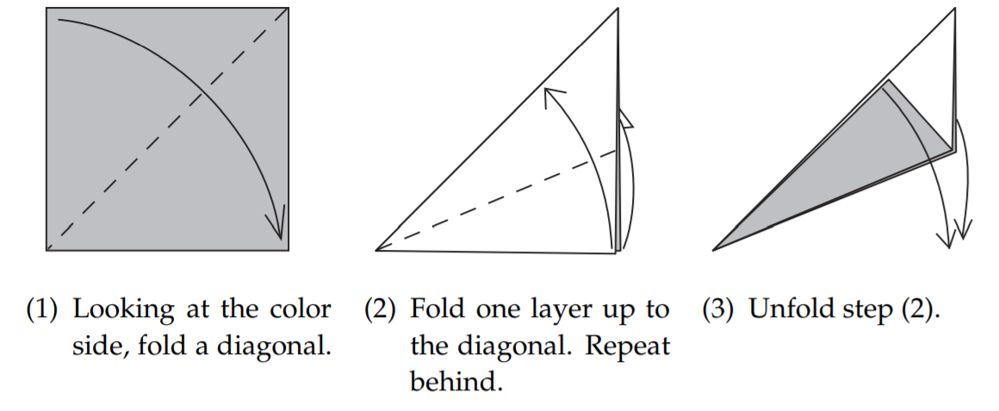

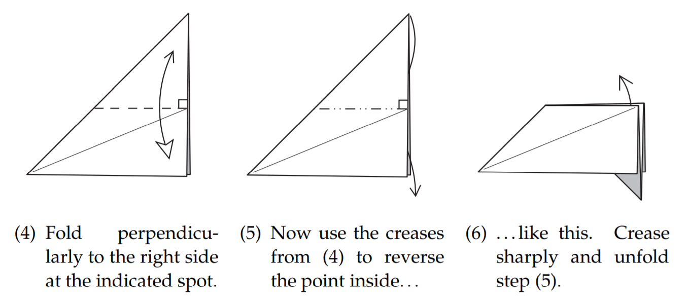

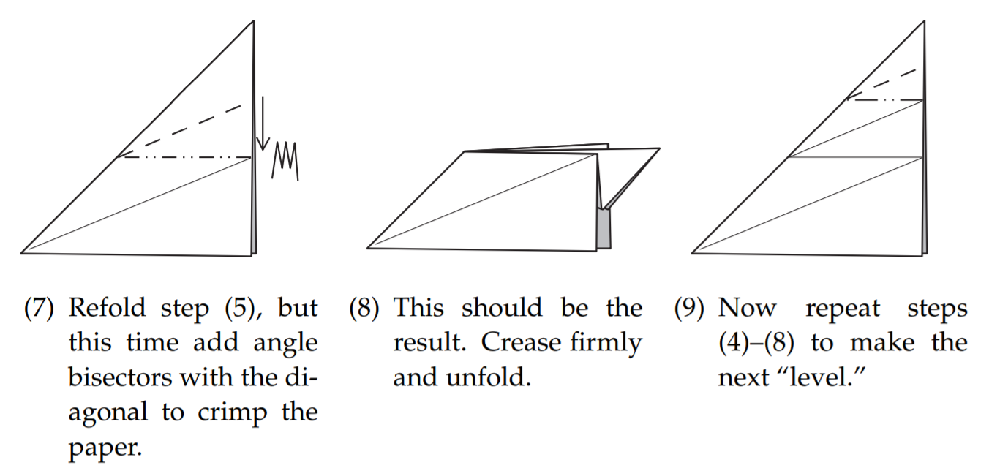

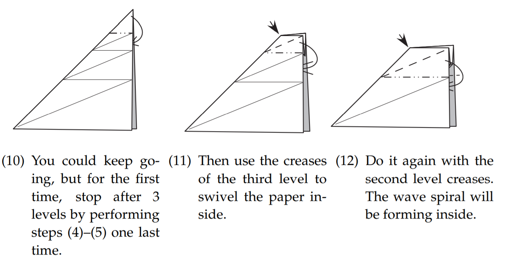

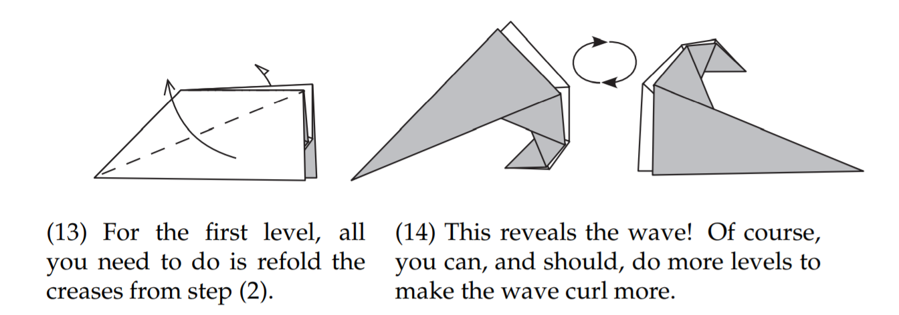

观察图$(14)$，可以看出它形成了一个螺旋

### 建系

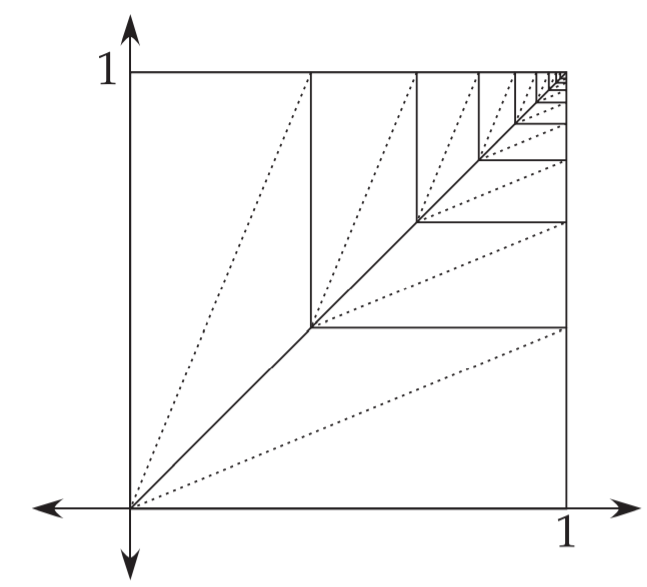

展开，观察折痕图，以纸的左下角为原点建立坐标系

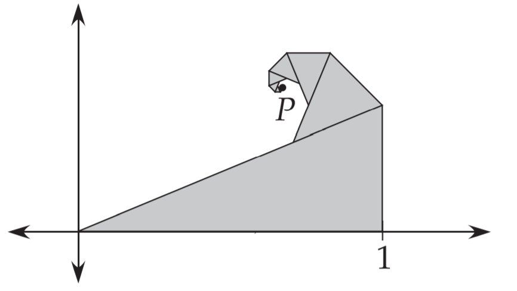

再把螺旋放在坐标系之中

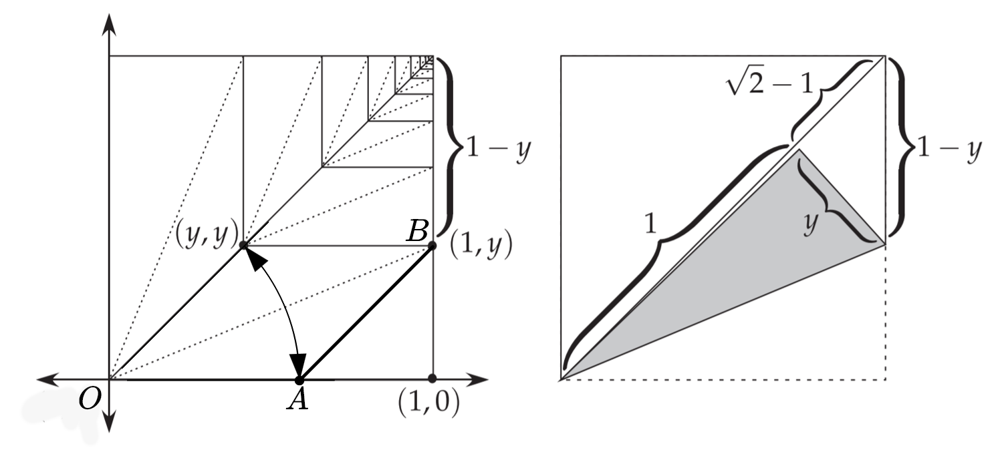

 观察右侧图形可以得到$y=\sqrt{2}-1$，$AB=1-y=2-\sqrt{2}=OA$

在继续之前，我们先了解一下旋转矩阵

## 旋转矩阵

对于任意点$(x,y)$，我们在极坐标系中表示为

$\left\{\begin{array}{l}
x=r \cos \phi \\
y=r \sin \phi 
\end{array}\right.$

如果把它绕原点旋转$\theta$角，可以得到旋转后的点在直角坐标系中的坐标为

$\left\{\begin{array}{l}
x^{\prime}=\operatorname{rcos}(\phi+\theta)=r \cos \phi \cos \theta-r \sin \phi \sin \theta=x \cos \theta-y \sin \theta \\
y^{\prime}=r \sin (\phi+\theta)=r \cos \phi \sin \theta+r \sin \phi \cos \theta=x \sin \theta+y \cos \theta
\end{array}\right .$

写成矩阵形式

$\left(\begin{array}{l}
x^{\prime} \\
y^{\prime}
\end{array}\right)=\left(\begin{array}{ll}
\cos \theta & -\sin \theta \\
\sin \theta & \cos \theta
\end{array}\right)\left(\begin{array}{l}
x \\
y
\end{array}\right)$

所以旋转矩阵$\mathbf{R}_{\theta}$为

$\mathbf{R}_{\theta}=\left(\begin{array}{l}
\cos \theta & -\sin \theta \\
\sin \theta & \cos \theta
\end{array}\right)$

理解旋转矩阵是我们接下来讨论的基础

### 分析

我们将螺旋透视化

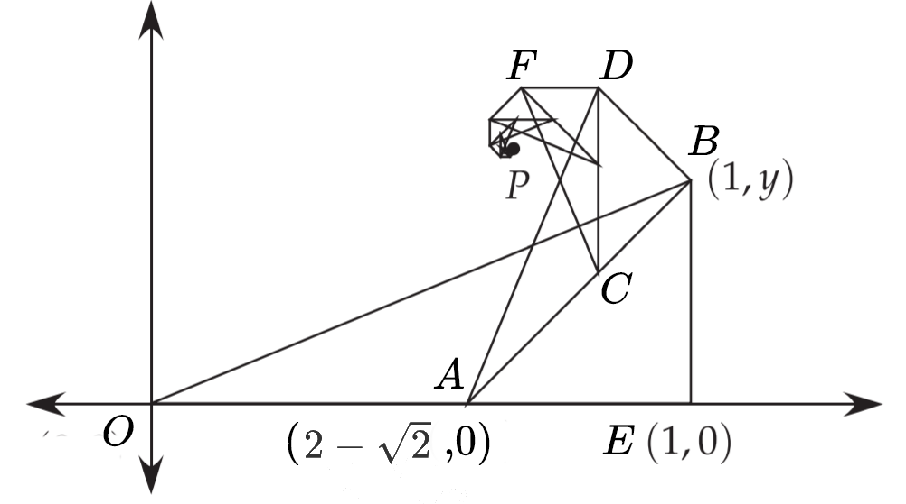

容易看出$\triangle OEB\sim \triangle ABD\sim \triangle CDF\cdots $

相似比为$\lambda= \frac {AB} {OE}=2-\sqrt 2$

观察$x$轴的基向量$\hat{\imath}=\overrightarrow{OE}$从$\overrightarrow{OE}$变化到$\overrightarrow{AB}$的过程，我们可以发现，实际上$\overrightarrow{OE}$先乘了缩小因子$\lambda $变为了$\overrightarrow{OA}$，再绕着原点$O$逆时针旋转了$45^{\circ} $，最后沿原基向量$\overrightarrow{OE}$方向平移了$\lambda\overrightarrow{OE}$，便得到了变换后$x$轴的基向量$\hat{\imath}^{\prime}=\overrightarrow{AB}$

我们可以把这个仿射变换过程用矩阵形式表示

$F(x, y)=\left(\begin{array}{ll}
a & b \\
c & d
\end{array}\right)\left(\begin{array}{l}
x \\
y
\end{array}\right)+\left(\begin{array}{l}
e \\
f
\end{array}\right)$

其中的线性变换矩阵为

$\begin{aligned}
\left(\begin{array}{ll}
a & b \\
c & d
\end{array}\right) &=(2-\sqrt{2})\left(\begin{array}{cc}
\cos 45^{\circ} & -\sin 45^{\circ} \\
\sin 45^{\circ} & \cos 45^{\circ}
\end{array}\right) \\
&=\left(\begin{array}{ll}
2-\sqrt{2}
\end{array}\right)\left(\begin{array}{ll}
\frac{\sqrt{2}}{2} & -\frac{\sqrt{2}}{2} \\
\frac{\sqrt{2}}{2} & \frac{\sqrt{2}}{2}
\end{array}\right)=(\sqrt{2}-1)\left(\begin{array}{cc}
1 & -1 \\
1 & 1
\end{array}\right)
\end{aligned}$

所以我们的变换函数为

$F(x, y)=(\sqrt{2}-1)\left(\begin{array}{cc}
1 & -1 \\
1 & 1
\end{array}\right)\left(\begin{array}{c}
x \\
y
\end{array}\right)+\left(\begin{array}{c}
2-\sqrt{2} \\
0
\end{array}\right)$

## 分析

### 迭代函数系统iterated function systems (IFS)


迭代函数系统（Iterated Function System，IFS）是分形理论的重要分支 。它以仿射变换为框架，根据几何对象的整体与局部具有自相似的结构，将总体形状以一定的概率按不同的仿射变换迭代下去，直至得到满意的分形图形。相比较分形几何学，IFS与集合论关系更为密切。IFS在1981年提出。

### python程序例子

```python
import random
import matplotlib.pyplot as plt

x = 0
y = 0
for n in range(1500):
    r = random.random()
    r = r * 100
    xn = x
    yn = y
    if r < 1:
        x = 0
        y = 0.16 * yn
    elif r < 86:
        x = 0.85 * xn + 0.04 * yn
        y = -0.04 * xn + 0.85 * yn + 1.6
    elif r < 93:
        x = 0.20 * xn - 0.26 * yn
        y = 0.23 * xn + 0.22 * yn + 1.6
    else:
        x = -0.15 * xn + 0.28 * yn
        y = 0.26 * xn + 0.24 * yn + 0.44
    plt.scatter(x, y,s=6,c='g',alpha=0.7)
plt.show()
```

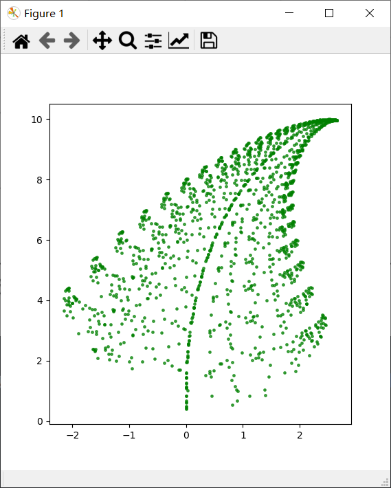

基于IFS机械式重复来生成图形的性质，我们可以利用计算机来模拟折叠的过程

### 实现

用MATLAB实现

```matlab
R_45=[0.7071   -0.7071 ; 0.7071    0.7071] ;%45°旋转矩阵
p=[1 ; 0];%初始点
move=[2-sqrt(2);0];%偏移量
for i=1:100
    pprime=(2-sqrt(2))*R_45*p+move;%变换后的点
    scatter(pprime(1),pprime(2),'filled')%描点
    line([p(1) pprime(1)],[p(2) pprime(2)])%连线
    hold on
    p=pprime;%更新
    disp(p)
    hold on
    grid on
end
xlim([.5 1.2])
ylim([0 .7])
ax = gca;
ax.XAxisLocation = 'origin';%坐标轴
ax.YAxisLocation = 'origin';
```

### 结果

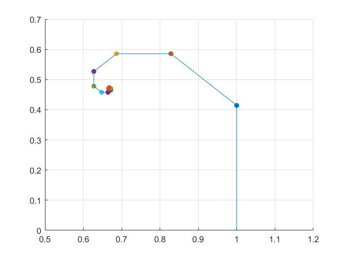

由图形可以看出，螺旋好像趋于一个特定的点，那么它的坐标是什么呢？

### 寻找不动点

在数学中，函数的**不动点**或**定点**是指被这个函数映射到其自身一个点

在我们的变换函数中如果有一个点经过函数变换后得到的仍是其本身，那我们的图形就不再前进，这个点就是不动点

写成矩阵形式为

$\left(\begin{array}{c}
x \\
y
\end{array}\right)=(\sqrt{2}-1)\left(\begin{array}{cc}
1 & -1 \\
1 & 1
\end{array}\right)\left(\begin{array}{c}
x \\
y
\end{array}\right)+\left(\begin{array}{c}
2-\sqrt{2} \\
0
\end{array}\right)$

化简得

$ \left(\begin{array}{c}x \\y\end{array}\right) = \left( \begin{array}{c} ( \sqrt { 2 } - 1 ) ( x - y ) + 2 - \sqrt { 2 }  \\  ( \sqrt { 2 } - 1 ) ( x + y )\end{array}\right)$

于是得到一个二元一次方程组

$\left\{\begin{array}{l}
 (\sqrt { 2 } - 2 ) x - ( \sqrt { 2 } - 1 ) y + 2 - \sqrt { 2 } = 0  \\
(\sqrt { 2 } - 1 ) x + ( \sqrt { 2 } - 2 ) y = 0  
\end{array}\right.$

解得

$\left\{\begin{array}{l}x=\frac{2}{3}\\y=\frac{\sqrt{2}}{3}\end{array}\right.$

于是点$(\frac{2}{3},\frac{\sqrt{2}}{3})$就是我们要找的不动点

## 利用复数

 考察$ e^{\mathrm{i}x} $的幂级数展开式的实部和虚部。用$\mathrm{i}$的幂以长度4循环$ 1, i,-1,-i, 1, \cdots$，所以有

$\begin{aligned}
\mathrm{e}^{\mathrm{i} x} &=1+\mathrm{i} x+\frac{(\mathrm{i} x)^{2}}{2 !}+\frac{(\mathrm{i} x)^{3}}{3 !}+\cdots \\
&=\left[1-\frac{x^{2}}{2 !}+\frac{x^{4}}{4 !}+\cdots\right]+\mathrm{i}\left[x-\frac{x^{3}}{3 !}+\frac{x^{5}}{5 !}+\cdots\right] \\
&=\cos x+\mathrm{i} \sin x
\end{aligned}$

以下图的方式构造复平面

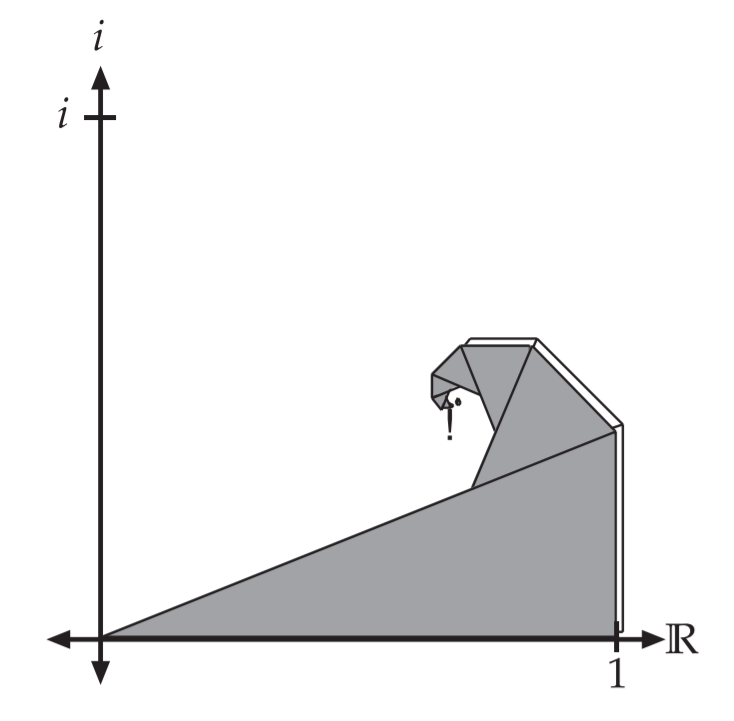

将螺旋透视化

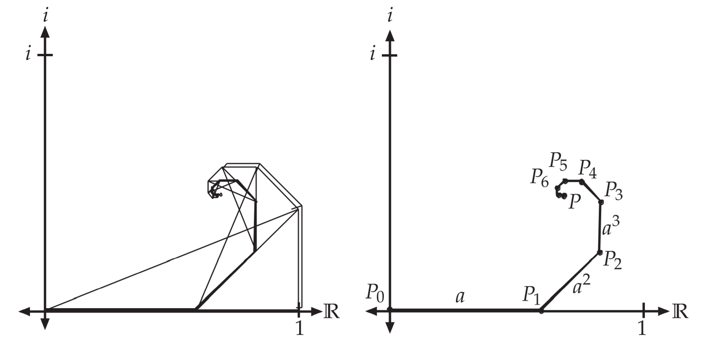

由上面的分析可知，螺旋以右图的形式前进，$P_0P_1+P_1P_2+P_2P_3+\cdots+P_{n-1}P_{n}$即为$P_n$在复平面中的坐标

从$P_0P_1$到$P_1P_2$，就是先逆时针旋转$\frac \pi 4$，再乘上缩小因子$a= 2-\sqrt 2$，所以

$P_{1}=2-\sqrt{2}$

$P_{2}=P_{1}+a^{2} e^{(\pi/4) i}=a+a^{2} e^{(\pi/4) i} $

$P_{3}=P_{2}+a^{3} e^{2(\pi / 4) i}=a+a^{2} e^{(\pi / 4) i}+a^{3} e^{2(\pi / 4) i}$

不断迭代

$P_{n}=a+a^{2} e^{\frac{\pi}{4} i}+a^{3} e^{2 \frac{\pi}{4} i}+\cdots+a^{n} e^{(n-1) \frac{\pi}{4} i}$

当$n\to \infty$时，有

$P=a \sum_{n=0}^{\infty}\left(a e^{\frac{\pi}{4} i}\right)^{n}$

这是一个几何级数，所以

$\sum_{n=0}^{\infty} z^{n}=\frac{1}{(1-z)}$

其中

$\begin{aligned}z&=a e^{(\pi / 4) i}\\&=(2-\sqrt{2})(\cos (\pi / 4)+i \sin (\pi / 4))\\&=(2-\sqrt{2})((\sqrt{2} / 2)+(\sqrt{2} / 2) i)\\&=
(\sqrt{2}-1)(1+i)\end{aligned}$

$a=2-\sqrt{2}=2 /(2+\sqrt{2})$

所以我们的不动点为

$\begin{aligned}P&=(2-\sqrt{2}) \frac{1}{1-(\sqrt{2}-1)(1+i)}\\&=\frac{2}{2+\sqrt{2}} \frac{1}{(2-\sqrt{2})-(\sqrt{2}-1) i}\\&=\frac{2}{2-\sqrt{2} i}\end{aligned}$

同时乘以共轭复数

$$
\begin{aligned}P&=\frac{2}{2-\sqrt{2} i} \frac{2+\sqrt{2} i}{2+\sqrt{2} i}\\&=\frac{4+2 \sqrt{2} i}{6}\\&=\frac{2}{3}+\frac{\sqrt{2}}{3} i\end{aligned}
$$
这和我们用矩阵方法求解的答案是一样的

### 对数螺线

计算螺线上任意一点$P_n$到不动点$P$的距离

$$
\begin{aligned}
\left|P-P_{n}\right|&=\left|a \sum_{k=n}^{\infty}\left(a e^{\frac{\pi}{4} i}\right)^{k}\right|=\left|a\left(a e^{\frac{\pi}{4} i}\right)^{n} \sum_{k=0}^{\infty}\left(a e^{\frac{\pi}{4} i}\right)^{k}\right|\\&=\left|(2-\sqrt{2})((\sqrt{2}-1)(1+i))^{n}\right| \cdot|P|\\&=(2-\sqrt{2})((\sqrt{2}-1) \sqrt{2})^{n} \frac{\sqrt{6}}{3}\\&=\frac{\sqrt{6}}{3}(2-\sqrt{2})^{n+1}\end{aligned}
$$
这是一个几何级数，而对数螺线的臂的距离以几何级数递增，所以螺线是对数螺线

实际上，它的方程在极坐标系中表示为

$r(\theta)=\frac{\sqrt{6}}{3}(2-\sqrt{2})^{\frac{4}{\pi}(\theta-\pi-\arctan (\sqrt{2} / 2))}$

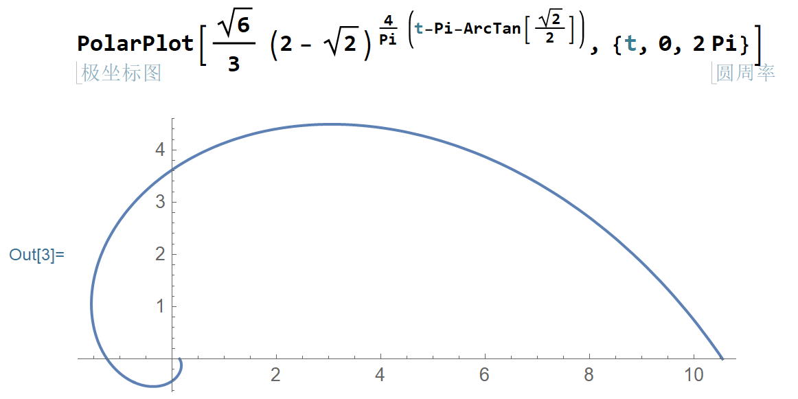

这种折法在折纸艺术中非常常见，以下是几个折纸作品

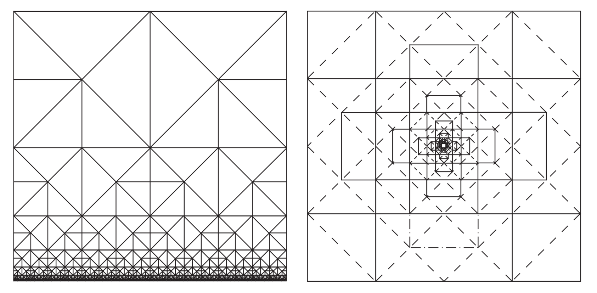

### 镶嵌折纸作品欣赏

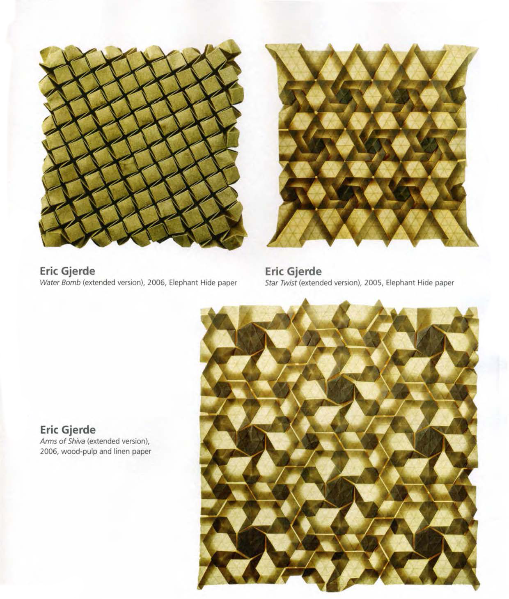