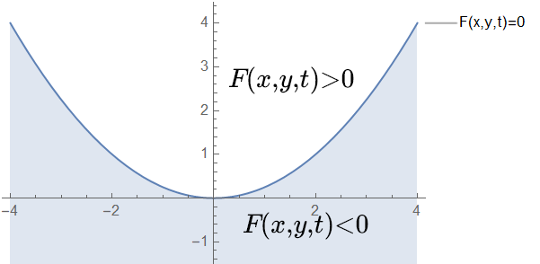

# 5.抛物线折叠

取一张纸，将边线当做线$L$，在纸上取点$P$，将$P$折叠到$L$上，对应点为$P'$，压出折痕，如下图所示

观察折痕所形成的图形

看上去像是一条抛物线，但我们需要严格证明

### 分析：

以$O$为原点建立坐标系，使得$p$点坐标为$(0,1)$，$p'$点的坐标为$(t,1)$，下面求折线的方程

因为折线$l$是$pp'$的中垂线

$\left. { k_{pp^ { \prime }} = \frac { 2 } { t } } \\ { k _ { l } = \frac { t } { 2 } } \\ { y - 0 = \frac { t } { 2 } ( x - \frac { t } { 2 } ) } \\ { y = \frac { t } { 2 } x - \frac { t ^ { 2 } } { 4 } } \right.$

这就是折线的方程

## 求解抛物线方程

### 带入法：

考虑折线上横坐标为$t$的一点$M$

将$t=x$代入折线方程

$y = \frac { x } { 2 } \cdot x - \frac { x ^ { 2 } } { 4 } = \frac { x ^ { 2 } } { 4 }$

这就是当$p'$在$L$上运动时，点$M$的轨迹方程

### 切线法：

折线即为抛物线的切线

$\frac{d y}{d x}=\frac{x}{2}$

两边积分得

$y=\frac{x^{2}}{4}+C$

又当$p'=(0,-1)$时，函数过$O=(0,0)$，故$C=0$，即

$y=\frac{x^{2}}{4}$

### 包络线法：

将折线方程化成有三个变量的隐式方程

$\left. { 4 y = 2 t x - t ^ { 2 } } \\ { t ^ { 2 } - 2 t x + 4 y = 0 } \\ { F ( x , y , t ) = t ^ { 2 } - 2 t x + 4 y }  \right.$

带入包络线线上方一点$(0,1)$

$F ( 0,1 , t ) = t ^ { 2 } - 0 + 4 > 0$

故图像被分为两个区域

这个关系是对任意的$t$都成立

考虑包络线上一点$(x_0,y_0)$，仅存在一个$t$使得$F(x_0,y_0, t)=0$，对其余$t$的题都有$F(x_0,y_0, t)>0$

所以$F(x_0,y_0, t)$对$t$有极值，又因为$(x_0,y_0)$必须在折线上，故

$\left\{  \begin{array}{**lr**}    F(x, y, t)=0 \\ \frac{\partial}{\partial t} F(x, y, t)=0\end{array} \right.$

$\frac{\partial}{\partial t} F(x, y, t)=2 t - 2 x=0$

解得

$t=x$

将$t=x$代入隐式方程，同样得到

$y = \frac { x } { 2 } \cdot x - \frac { x ^ { 2 } } { 4 } = \frac { x ^ { 2 } } { 4 }$

## More examples

## 斜抛运动包络线：

## 性质

重新观察这张图，$\frac{Mp}{Mp^{\prime}}=e=1$，根据抛物线的第二定义

将$p$到$L$上所形成的折线便是以$p$为焦点，以$L$为准线的抛物线的一条切线，这个性质将在下一节中起到非常重要的作用。

