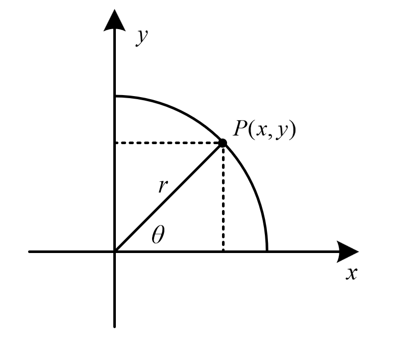

$$
r=\sqrt{x^{2}+y^{2}}
$$

$$
\begin{array}{|c|c|}
\hline   \sin\theta&\cos\theta&\tan\theta&\cot\theta\\
\hline y/r& x/r&y/x&x/y \\
\hline 

\end{array}
$$

# 同角三角函数

$$
\tan \alpha=\frac{\sin \alpha}{\cos \alpha}, \cot \alpha=\frac{\cos \alpha}{\sin \alpha}
$$

$$
\boxed{\sin ^{2} \alpha+\cos ^{2} \alpha=1}
$$

# 两角

$$
\sin (\alpha\pm\beta)=\sin \alpha \cdot \cos \beta\pm\cos \alpha \cdot \sin \beta \\

\cos (\alpha\pm\beta)=\cos \alpha \cdot \cos \beta\mp\sin \alpha \cdot \sin \beta \\
 \\
\tan (\alpha+\beta)=\frac{\tan \alpha+\tan \beta}{1-\tan \alpha \cdot \tan \beta} \\
\tan (\alpha-\beta)=\frac{\tan \alpha-\tan \beta}{1+\tan \alpha \cdot \tan \beta}
$$

## 倍角

$$
\sin 2 \alpha=2 \sin \alpha \cos \alpha \\
\begin{aligned}
\cos 2 \alpha&=\cos ^{2} \alpha-\sin ^{2} \alpha\\&=2 \cos ^{2} \alpha-1\\&=1-2 \sin ^{2} \alpha\end{aligned}
$$

## 半角

$$
\cos ^{2} \alpha=\frac{1+\cos 2 \alpha}{2}
$$

$$
\sin ^{2} \alpha=\frac{1+\sin 2 \alpha}{2}=\frac{1-\cos 2 \alpha}{2}
$$

$$
\begin{array}{l} \tan \alpha&=\frac{\sin \alpha}{\cos \alpha}\\&
=\frac{\sin^2\alpha}{\cos \alpha\sin  \alpha}=\frac{1-\cos 2 \alpha}{\sin 2 \alpha}\\&
=\frac{\sin\alpha\cos\alpha}{\cos^2 \alpha}
=\frac{\sin 2 \alpha}{1+\cos 2\alpha}\end{array}
$$

$$
{\begin{aligned}\tan \frac {\theta }{2}&=\pm \,{\sqrt {1-\cos \theta  \over 1+\cos \theta }}\\&=\frac {\sin \theta }{1+\cos \theta }\\&=\frac {1-\cos \theta }{\sin \theta }\\&=\frac {\cos \theta +\sin \theta -1}{\cos \theta -\sin \theta +1}\end{aligned}}
$$

## 万能

$$
\boxed{\sin 2 \alpha=\frac{2 \tan \alpha}{1+\tan ^{2} \alpha}, \quad \cos 2 \alpha=\frac{1-\tan ^{2} \alpha}{1+\tan ^{2} \alpha}, \quad \tan 2 \alpha=\frac{2 \tan \alpha}{1-\tan ^{2} \alpha} }
$$

$$
\sin \alpha=\frac{2 \sin \frac{\alpha}{2} \cos \frac{\alpha}{2}}{\sin ^{2} \frac{\alpha}{2}+\cos ^{2} \frac{\alpha}{2}}=\frac{2 \tan \frac{\alpha}{2}}{1+\tan ^{2} \frac{\alpha}{2}}=\frac{2 t}{1+t^{2}}\\
\cos \alpha=\frac{\cos ^{2} \frac{\alpha}{2}-\sin ^{2} \frac{\alpha}{2}}{\cos ^{2} \frac{\alpha}{2}+\sin ^{2} \frac{\alpha}{2}}=\frac{1-\tan ^{2} \frac{\alpha}{2}}{1+\tan ^{2} \frac{\alpha}{2}}=\frac{1-t^{2}}{1+t^{2}}\\\tan \alpha=\frac{\sin \alpha}{\cos \alpha}=\frac{2 \tan \frac{\alpha}{2}}{1-\tan ^{2} \frac{\alpha}{2}}=\frac{2 t}{1-t^{2}}
$$

## 和差化积

$$
\begin{array}{l}
\sin \alpha+\sin \beta=2 \sin \frac{\alpha+\beta}{2} \cos \frac{\alpha-\beta}{2}\\
\sin \alpha-\sin \beta=2 \cos \frac{\alpha+\beta}{2} \sin \frac{\alpha-\beta}{2}\\
\cos \alpha+\cos \beta=2 \cos \frac{\alpha+\beta}{2} \cos \frac{\alpha-\beta}{2}\\
\cos \alpha-\cos \beta=-2 \sin \frac{\alpha+\beta}{2} \sin \frac{\alpha-\beta}{2}
\end{array}
$$

## 积化和差
$$
\begin{array}{l}
\sin \alpha \cos \beta=\frac{1}{2}[\sin (\alpha+\beta)+\sin (\alpha-\beta)] \\
\cos \alpha \sin \beta=\frac{1}{2}[\sin (\alpha+\beta)-\sin (\alpha-\beta)] \\
\cos \alpha \cos \beta=\frac{1}{2}[\cos (\alpha-\beta)+\cos (\alpha+\beta)] \\
\sin \alpha \sin \beta=\frac{1}{2}[\cos (\alpha-\beta)-\cos (\alpha+\beta)]
\end{array}
$$

## 辅助角

$$
a \sin \alpha \pm b \cos \alpha=\sqrt{a^{2}+b^{2}} \sin (\alpha \pm \varphi) \text { 其中 } \tan \varphi=\frac{b}{a}(a \neq 0)\\
\sin \varphi=\frac{b}{\sqrt{a^{2}+b^{2}}}, \cos \varphi=\frac{a}{\sqrt{a^{2}+b^{2}}}
$$

### 解三角形

$$
\cos C = \frac{a^2} + {b^2} - {c^2}{2ab} = \frac{\overrightarrow a  \cdot \overrightarrow b }{|a| \cdot |b|}\\
\frac{a}{\sin A} = \frac{b}{\sin B} = \frac{c}{\sin C} = 2R\\
{S_{\triangle} = \frac{1}{2}xh = \frac{1}{2}ab\sin C =\frac{1}{2}Cr}
$$

$$
{S_{\triangle}}=\frac{1}{2}|{x_1}{y_2} - {x_2}{y_1}|=\frac{{abc}}{{4R}} = \sqrt {p(p - a)(p - b)(p - c)}\\{a_n} = {a_1} + (n - 1)d,S_n=\frac{n(a_1+a_n)}2=na_1+\frac{n(n-1)}2d\\
a \sin \alpha \pm b \cos \alpha=\sqrt{a^{2}+b^{2}} \sin (\alpha \pm \varphi) \text { 其中 } \tan \varphi=\frac{b}{a}(a \neq 0)\\
\left| {\left| a \right| - \left| b \right|} \right| \leqslant \left| {a + b} \right| \leqslant \left| a \right| + \left| b \right|\quad \left| x \right| < a \Leftrightarrow  - a < x < a\\
\frac{a+b\mathrm{i}  }{c+d\mathrm{i}  }=\frac{(a+b\mathrm{i})(c-d\mathrm{i})}{(c+d\mathrm{i})(c-d\mathrm{i})}=\frac{(ac+bd)+(bc-ad)\mathrm{i}  }{c^2+d^2}
$$

$$
\tan \alpha=\frac{\sin \alpha}{\cos \alpha}, \cot \alpha=\frac{\cos \alpha}{\sin \alpha}\\
\\\sin 2 \alpha=2 \sin \alpha \cos \alpha \\\boxed{\sin ^{2} \alpha+\cos ^{2} \alpha=1}\\
\begin{aligned}
\cos 2 \alpha&=\cos ^{2} \alpha-\sin ^{2} \alpha\\&=2 \cos ^{2} \alpha-1\\&=1-2 \sin ^{2} \alpha\end{aligned}
$$
