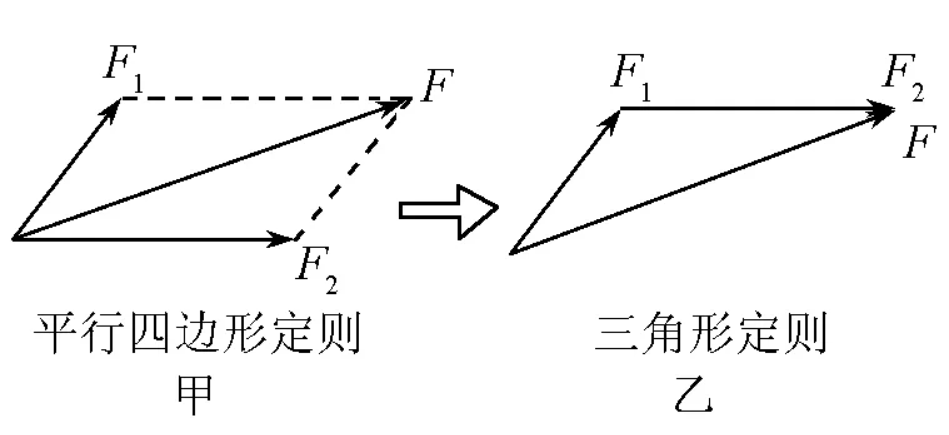
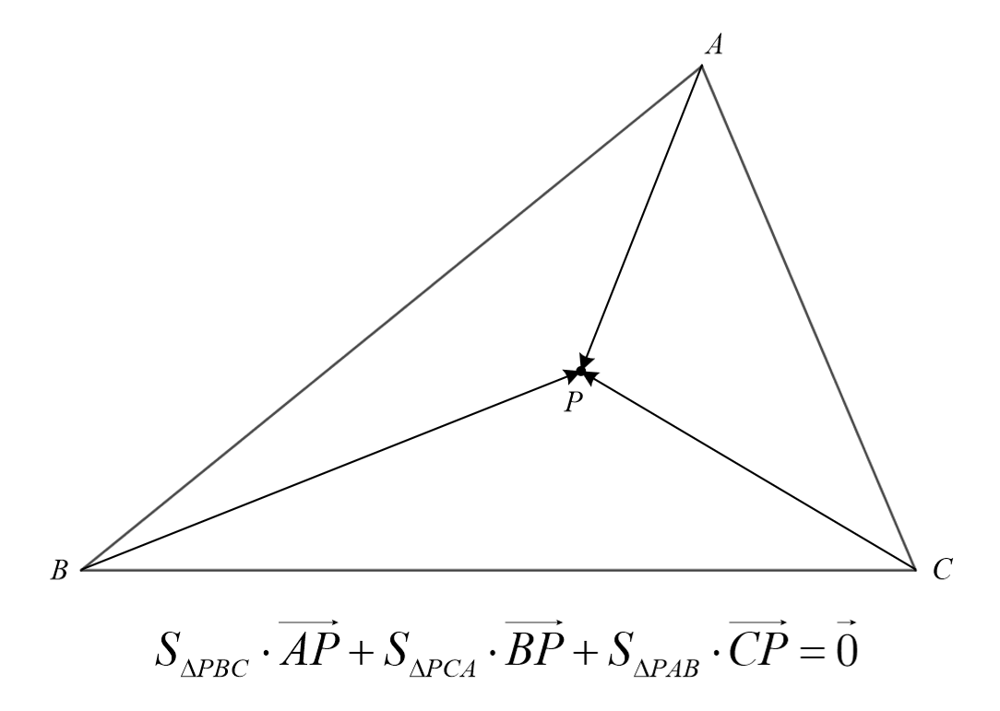

# 向量

$$
\vec {AB}=(x,y),\displaystyle |{\overrightarrow {AB}}|=\sqrt {x^2 + y^2}\\
\overrightarrow a  \pm \overrightarrow b  = ({x_1} \pm {x_2},{y_1} \pm {y_2})\\
\begin{aligned}
\overrightarrow a  \cdot \overrightarrow b  &= {x_1}{x_2} + {y_1}{y_2}\\&=\left| {\overrightarrow a } \right| \cdot \left| {\overrightarrow b } \right| \cdot \cos \left\langle {\overrightarrow a ,\overrightarrow b } \right\rangle \\&=\left| {\overrightarrow a } \right| \cdot l_{a在b上的投影}
\end{aligned}\\
\begin{aligned}
\overrightarrow a   \times  \overrightarrow b  &= {x_1}{y_2} - {x_2}{y_1}\\&=\left| {\overrightarrow a } \right| \cdot \left| {\overrightarrow b } \right| \cdot \sin \left\langle {\overrightarrow a ,\overrightarrow b } \right\rangle \\&=S_{平行四边形}
\end{aligned}\\
$$

## 奔驰定理

