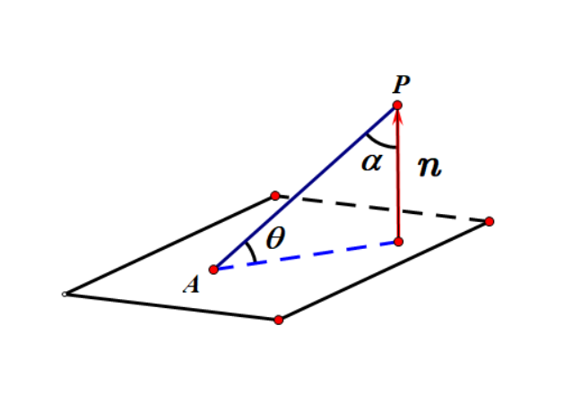
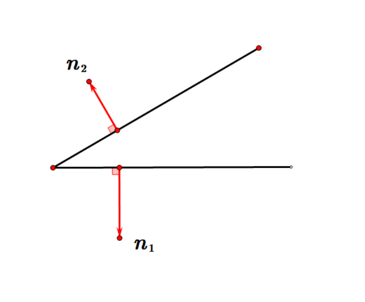
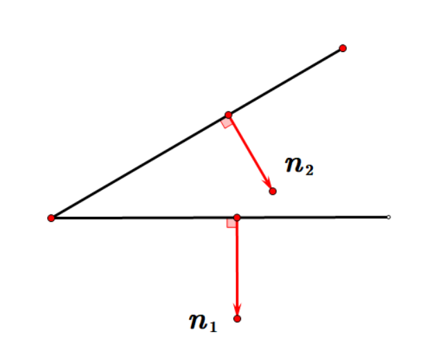
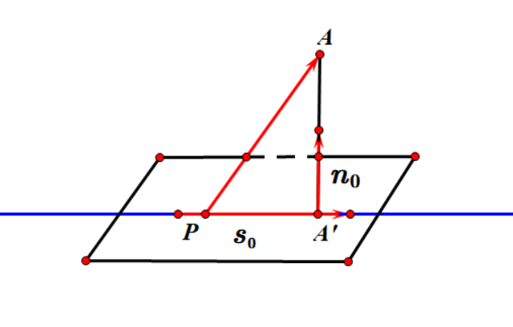
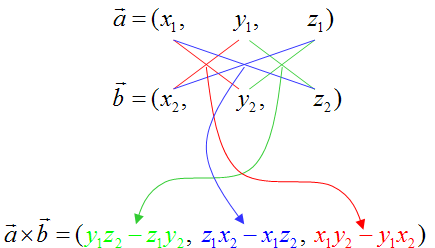

# 立体几何

## 斜二测画法

$y$轴顺时针旋转$45^{\circ} $，已知图形中平行于$x$轴的线段在直观图中长度保持不变，平行于$y$轴的线段长度变成原来的一半
$$
i=\left[ {\begin{array}{*{20}c}1\\0\end{array}  } \right] \rightarrow\left[ {\begin{array}{*{20}c}1\\0\end{array}  } \right]
$$

$$
j=\left[ {\begin{array}{*{20}c}0\\1\end{array}  } \right]\rightarrow\left[ {\begin{array}{*{20}c}\frac{\sqrt{2}  }{4} \\\frac{\sqrt{2}  }{4}\end{array}  } \right]
$$

斜二测画法的变换矩阵
$$
\left[ {\begin{array}{*{20}c}x'\\y'\end{array}  } \right]=\left[{\begin{array}{*{20}c}1&\frac{\sqrt{2}  }{4}\\0&\frac{\sqrt{2}  }{4}\end{array}  } \right]\left[ {\begin{array}{*{20}c}x\\y\end{array}  } \right]
$$

变换前后的面积比
$$
\frac{S'}{S}=\left|{\begin{array}{*{20}c}1&\frac{\sqrt{2}  }{4}\\0&\frac{\sqrt{2}  }{4}\end{array}  }\right|=\frac{\sqrt{2}  }{4}
$$

 三维空间内的
$$
\left[ {\begin{array}{*{20}c}x'\\y'\\z'\end{array}  } \right]=\left[ \begin{array}{*{20}c}  { 1 } & { \frac { \sqrt { 2 } } { 4 } } & { 0 } \\ { 0 } & { \frac { \sqrt { 2 } } { 4 } } & { 1 } \\ { 0 } & { 0 } & { 0 } \end{array} \right]\left[ {\begin{array}{*{20}c}x\\y\\z\end{array}  } \right]
$$

特殊法求解
$$
\text{
该变换写为}\begin{cases}  { x ^ { \prime } = a _ { 1 } x + b _ { 1 } y + c _ { 1 } z } \\ { y ^ { \prime } = a _ { 2 } x + b _ { 2 } y + c _ { 2 } z } \end{cases}
$$

$$
\text{带入可得}\begin{cases}   { x ^ { \prime } = x + \frac { \sqrt { 2 } } { 4 } y } \\ { y ^ { \prime } = z + \frac { \sqrt { 2 } } { 4 } y } \end{cases}
$$

## 公理与定理

### 公理一

$$
A\in l,B\in l, C\notin l \Rightarrow \exists \alpha \quad s.t.\quad A,B,C\in\alpha
$$

### 公理二

$$
A,B\in\alpha,A,B\in l \Rightarrow l\subset\alpha
$$

### 公理三

$$
P\in\alpha,P\in\beta \Rightarrow \alpha \cap\beta=l\quad and\quad P\in l
$$

$$
A\in l,B\in l, C\notin l \Rightarrow \exists \alpha \quad s.t.\quad A,B,C\in\alpha\\
A,B\in\alpha,A,B\in l \Rightarrow l\subset\alpha\\
P\in\alpha,P\in\beta \Rightarrow \alpha \cap\beta=l\quad \text{and}\quad P\in l\\\begin{cases}{a\nsubseteqq \beta},a\parallel b,b\subset\beta\Rightarrow a\parallel \beta\\a\parallel \beta,a\subset \alpha ,\alpha \cap\beta=l\Rightarrow a\parallel l\end{cases}
$$

### 平行

$$
\begin{cases}{a\nsubseteqq \beta},a\parallel b,b\subset\beta\Rightarrow a\parallel \beta\\a\parallel \beta,a\subset \alpha ,\alpha \cap\beta=l\Rightarrow a\parallel l\end{cases}
$$

$$
\begin{cases}a\parallel \alpha,b\parallel \alpha,{a\cap b=P},a,b\subset\beta\Rightarrow\alpha\parallel \beta\\
\alpha\parallel \beta,\gamma\cap\alpha=a,\gamma\cap\beta=b\Rightarrow a\parallel b
\end{cases}
$$

### 垂直

$$
\begin{cases}l\perp m,l\perp n\;,{m\cap m=P},m,n\subset\beta\Rightarrow  l\perp \beta\\
a\perp\beta,b\perp\beta\Rightarrow a\parallel b
\end{cases}
$$

$$
\begin{cases}l\perp \beta,l\subset \alpha \Rightarrow \alpha\perp \beta\\
\alpha\perp\beta,a\subset\beta,\alpha \cap\beta=l,a\perp l\Rightarrow a\perp \alpha
\end{cases}
$$

$$
\begin{cases}a\parallel \alpha,b\parallel \alpha,{a\cap b=P},a,b\subset\beta\Rightarrow\alpha\parallel \beta\\
\alpha\parallel \beta,\gamma\cap\alpha=a,\gamma\cap\beta=b\Rightarrow a\parallel b
\end{cases}\\
\begin{cases}l\perp m,l\perp n\;,{m\cap m=P},m,n\subset\beta\Rightarrow  l\perp \beta\\
a\perp\beta,b\perp\beta\Rightarrow a\parallel b
\end{cases}\\
\begin{cases}l\perp \beta,l\subset \alpha \Rightarrow \alpha\perp \beta\\
\alpha\perp\beta,a\subset\beta,\alpha \cap\beta=l,a\perp l\Rightarrow a\perp \alpha
\end{cases}
$$

## 面积体积公式

$$
圆锥\begin{cases} S_{侧}=\pi rl \\S_{底}=\pi r^2\\V=\frac13Sh\end{cases}
$$

$$
台\begin{cases} S_{侧}=\pi (r+r'
)l \\V=\frac13(S+\sqrt {SS'}+{S'})h\end{cases}
$$

$$
正四面体\begin{cases} h=\frac{\sqrt 6}{3}a \\  r_{外}=\frac{\sqrt 6}{4}a \\r_{内}=\frac{\sqrt 6}{12}a\end{cases}
$$

$$
球\begin{cases} S=4\pi R^2 \\V=\frac43\pi R^3\end{cases}
$$

## 空间向量

### 线线角

$\vec{a},\vec{b}$分别为直线$m,n$的方向向量
$$
\theta=\begin{cases}\arccos|\frac{|\vec{a}\cdot\vec{b} | }{|\vec{a}|\cdot|\vec{b}|}|,<\vec{a},\vec{b}>\in[0,\frac\pi2]\\
\pi-\arccos|\frac{|\vec{a}\cdot\vec{b} | }{|\vec{a}|\cdot|\vec{b}|}|,<\vec{a},\vec{b}>\in(\frac{\pi}{2},\pi ] \end{cases}
$$

$$
\cos\theta=\left |\frac{|\vec{a}\cdot\vec{\rm{n}  }|  }{|\vec{a}|\cdot|\vec{\rm{n}  }|}\right |
$$

### 线面角

$$
\sin\theta=\cos<\vec{a},\vec{\rm{n}  }>=\frac{|\vec{a}\cdot\vec{\rm{n}  }|  }{|\vec{a}|\cdot|\vec{\rm{n}  }|}
$$

### 面面角

$$
\begin{cases}\vec{\rm{n}  }\cdot\vec{a}=0 \\\vec{\rm{n}  }\cdot\vec{b}=0\end{cases}
$$

$$
\cos\theta=\left|\frac{\vec{\rm{n_1}  }\cdot\vec{\rm{n_2}  }  }{|\vec{\rm{n_1}  }|\cdot|\vec{\rm{n_2}  }|}\right |=\left|\frac{x_{1} x_{2}+y_{1} y_{2}+z_{1} z_{2}  }{\sqrt{x_{1}^{2}+y_{1}^{2}+z_{1}^{2}  } \sqrt{x_{2}^{2}+y_{2}^{2}+z_{2}^{2}  }  }\right |
$$

### 二面角

同进同出

$$
\cos\theta=-\frac{\vec{\rm{n_1}  }\cdot\vec{\rm{n_2}  }  }{|\vec{\rm{n_1}  }|\cdot|\vec{\rm{n_2}  }|}=-\frac{x_{1} x_{2}+y_{1} y_{2}+z_{1} z_{2}  }{\sqrt{x_{1}^{2}+y_{1}^{2}+z_{1}^{2}  } \sqrt{x_{2}^{2}+y_{2}^{2}+z_{2}^{2}  }  }
$$
一进一出

$$
\cos\theta=\frac{\vec{\rm{n_1}  }\cdot\vec{\rm{n_2}  }  }{|\vec{\rm{n_1}  }|\cdot|\vec{\rm{n_2}  }|}=\frac{x_{1} x_{2}+y_{1} y_{2}+z_{1} z_{2}  }{\sqrt{x_{1}^{2}+y_{1}^{2}+z_{1}^{2}  } \sqrt{x_{2}^{2}+y_{2}^{2}+z_{2}^{2}  }  }\\\vec{a} \times \vec{b}=\left(y_{1} z_{2}-z_{1} y_{2}, z_{1} x_{2}-x_{1} z_{2}, x_{1} y_{2}-y_{1} x_{2}\right)\\
d=|AA'|=\sqrt{\left |\vec{PA}\right |^2-\left |\frac{\vec{PA}\cdot\vec{s}  }{|\vec{s}|}\right |}=\left |\vec{PA}\cdot \vec{n_0}\right |
$$

### 距离

$$
\begin{array}{l}d=|AA'|&=\sqrt{\left |\vec{PA}\right |^2-\left |\frac{\vec{PA}\cdot\vec{s}  }{|\vec{s}|}\right |}\\&=\sqrt{\left |\vec{PA}\right |^2-\left |{\vec{PA}\cdot\vec{s_0}  }\right |}
\\&=\left |\vec{PA}\cdot \vec{n_0}\right |\end{array}
$$

### 叉积

$$
\vec{a} \times \vec{b}=\left(y_{1} z_{2}-z_{1} y_{2}, z_{1} x_{2}-x_{1} z_{2}, x_{1} y_{2}-y_{1} x_{2}\right)
$$

