# 解析几何

## 椭圆

### 第一定义

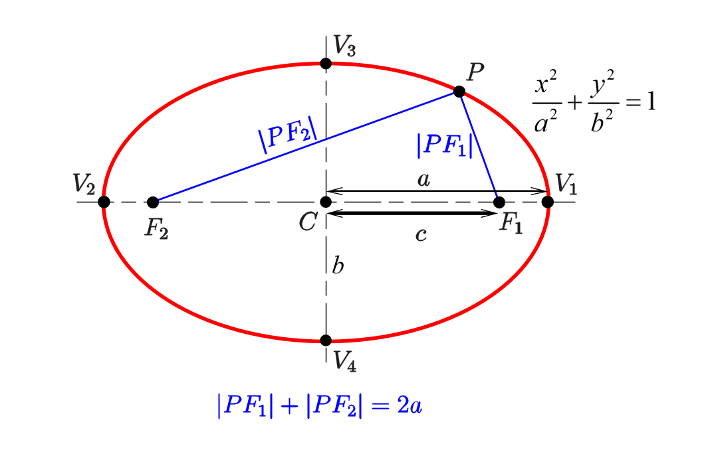
$$
\frac{x^2}{a^2} + \frac{y^2}{b^2} = 1(c^2 = a^2 - {b^2} )
$$

$$
e =\frac ca= \sqrt {1 - \frac{b^2}{a^2}  }  \in (0,1)
$$

### 第二定义

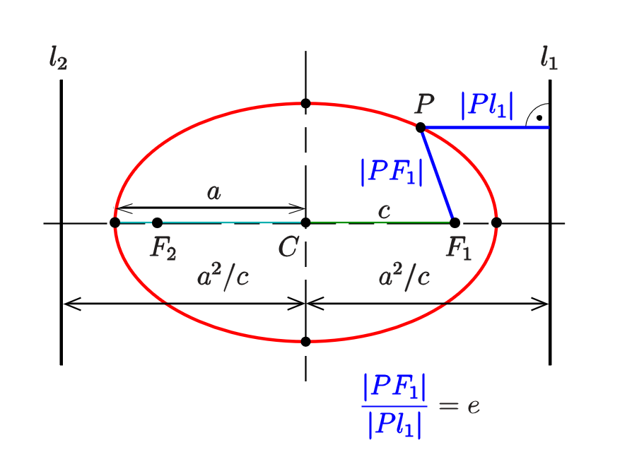
$$
准线\\\left\{ \begin{gathered}
  {l_1} = \frac{a^2}{c} > a \hfill \\
  {l_2} =  - \frac{a^2}{c} <  - a \hfill \\ 
\end{gathered}  \right.
$$

$$
\left\{ \begin{gathered}
  \left| {P{F_1}  } \right| = a - e \cdot {x_P} \hfill \\
  \left| {P{F_2}  } \right| = a + e \cdot {x_P} \hfill \\ 
\end{gathered}  \right.
$$

$$
通径H=\frac{2b^2}{a^2}
$$

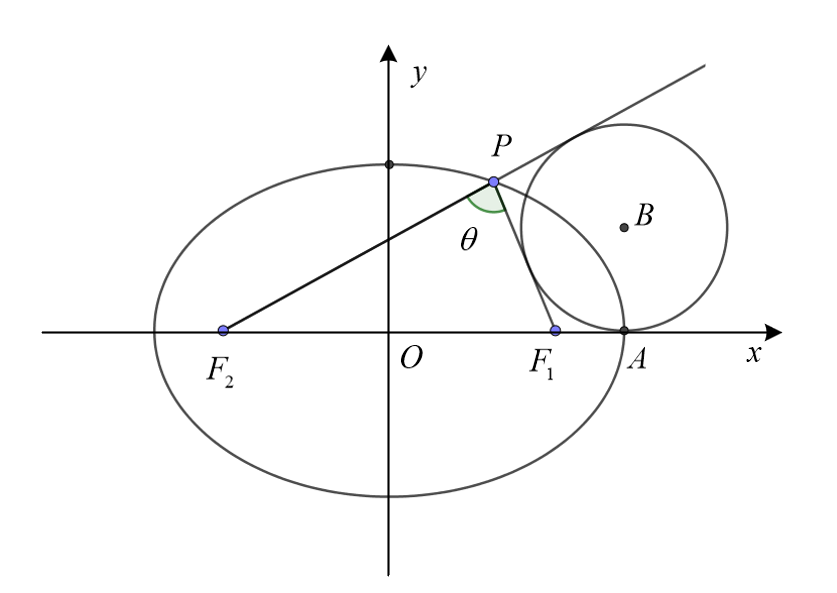
$$
S_{\Delta P{F_1}{F_2}  } = {b^2} \cdot \tan \frac{\ang F_1PF_2}{2}
$$

$$
\Delta P{F_1}{F_2}的外切圆B切x轴于顶点A
$$

### 第三定义

$$
k_{PF_1} \cdot k_{PF_2} =  - \frac{b^2}{a^2}
$$

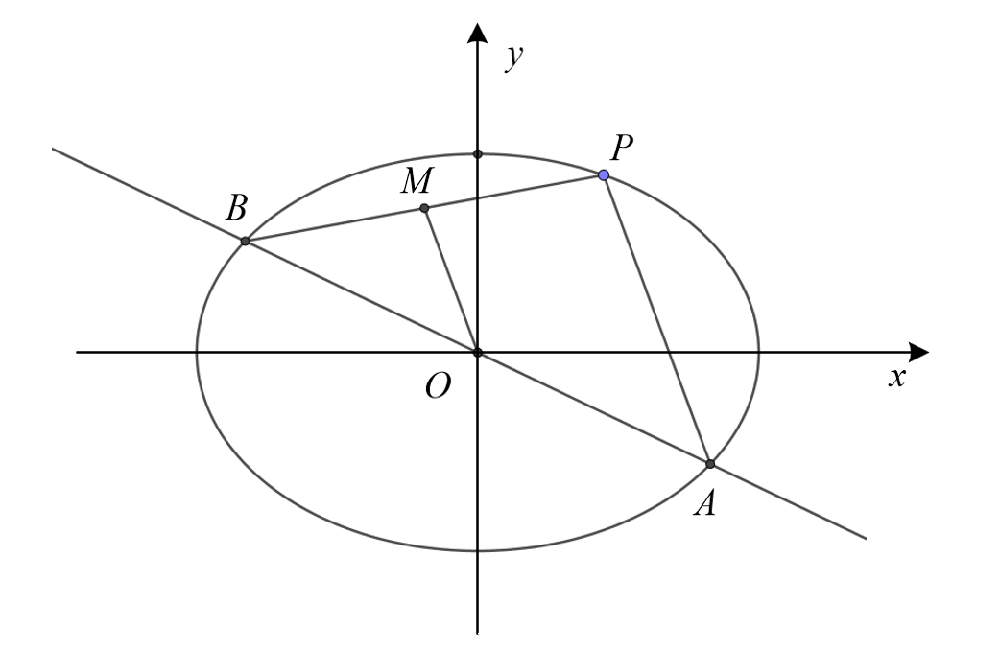
$$
中点弦\\
k_{OM} \cdot k_{PB}=k_{PA} \cdot k_{PB} =  - \frac{b^2}{a^2}
$$
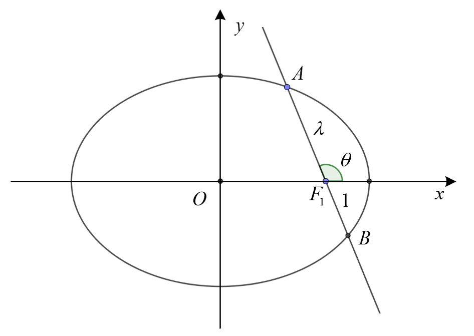
$$
e\cos \theta  = \left| \frac{1 - \lambda }{1 + \lambda } \right|,(\lambda  = \frac{AF_1}{BF_1})
$$

### 极坐标

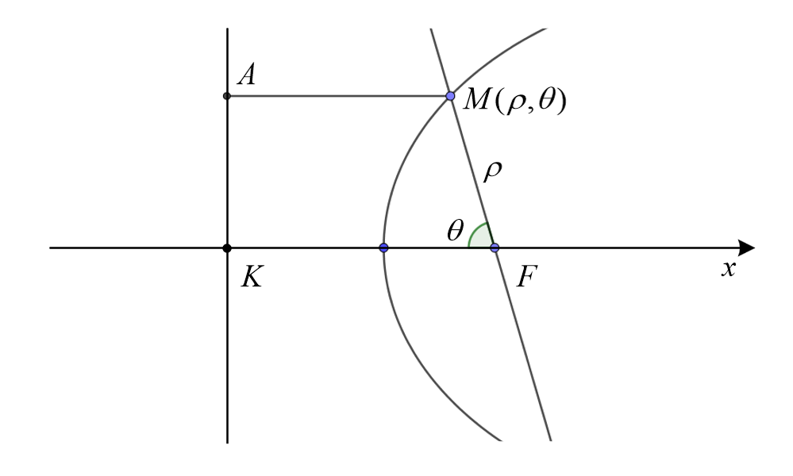
$$
\rho  = \frac{ep}{1 - e\cos \theta },(焦准距p =  \frac{b^2}{c})
$$

$$
L =  \left| \frac{H}{ {1 - {e^2}\cos ^2}\theta } \right|,(H=\frac{2b^2}{a}=2ep)
$$

### 参数方程

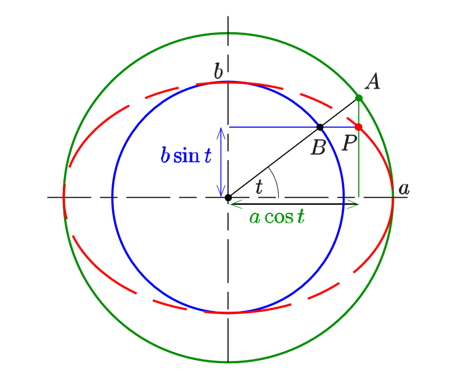
$$
\left\{ \begin{gathered}
  x = a\cos t \hfill \\
  y = b\sin t \hfill \\ 
\end{gathered}  \right.
$$

## 双曲线

### 第一定义

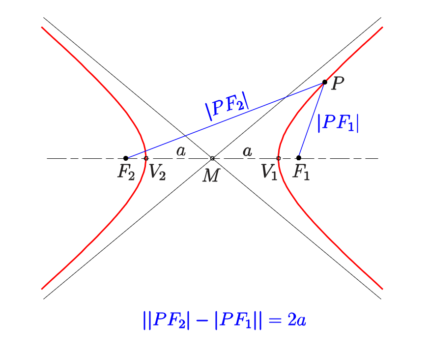
$$
\frac{ {  {x^2} }  } { { {a^2 } } }- \frac{ { {y^2} } }{ { {b^2} } } = 1(c = \sqrt { {a^2} + {b^2 } } )
$$

$$
\left| \left| {P{F_2}  } \right| - \left| {P{F_1}  } \right| \right| = 2a \Leftrightarrow \left| {P{F_2}  } \right| - \left| {P{F_1}  } \right| =  \pm 2a
$$

### 第二定义

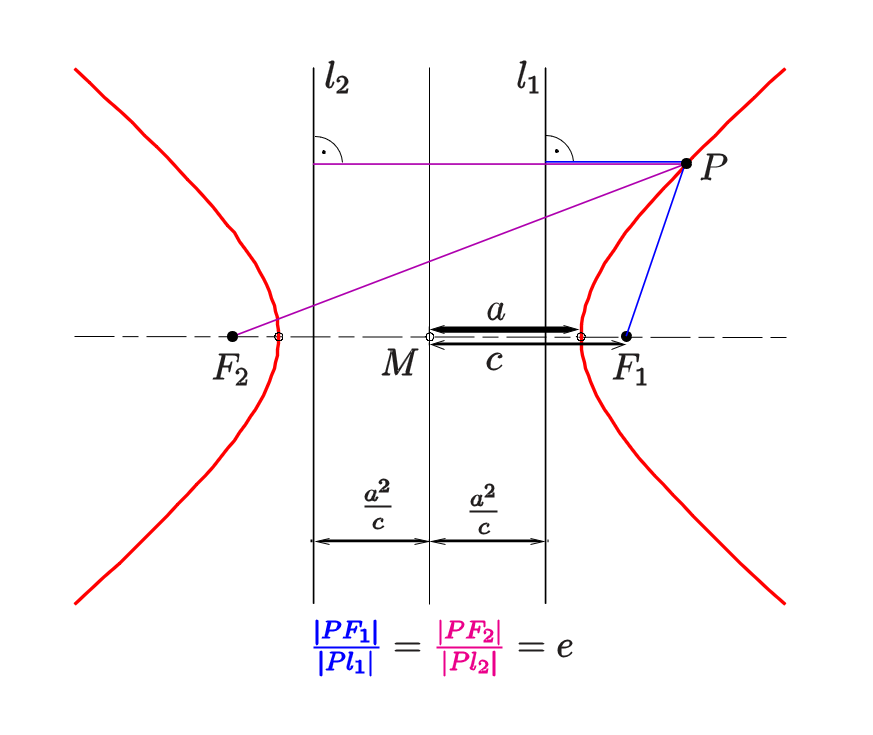
$$
e = \frac{c}{a} = \sqrt {1 + \frac{b^2}{a^2} }   > 1
$$

$$
\left\{ \begin{gathered}
  \left| {P{F_1}  } \right| = e{x_P} - a \hfill \\
  \left| {P{F_2}  } \right| = e{x_P} + a \hfill \\ 
\end{gathered}  \right.
$$

### 性质

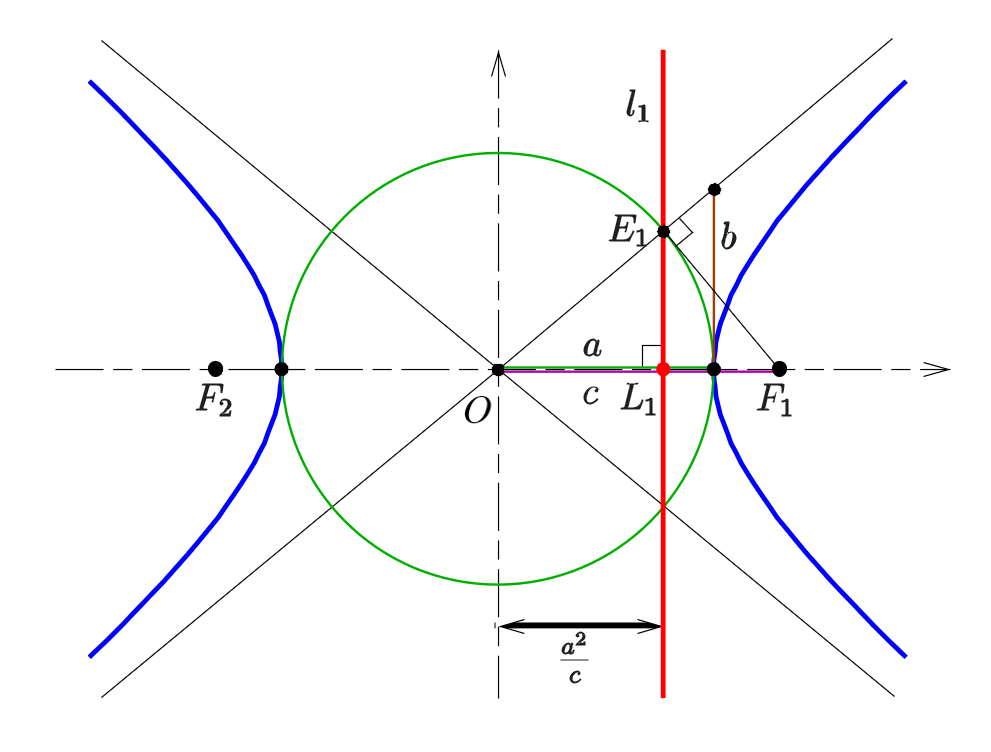
$$
渐近线\\
k =  \pm \frac{b}{a},O{E_1} \bot {E_1}{F_1}
$$

$$
O{E_1} = a,{E_1}{F_1} = b
$$

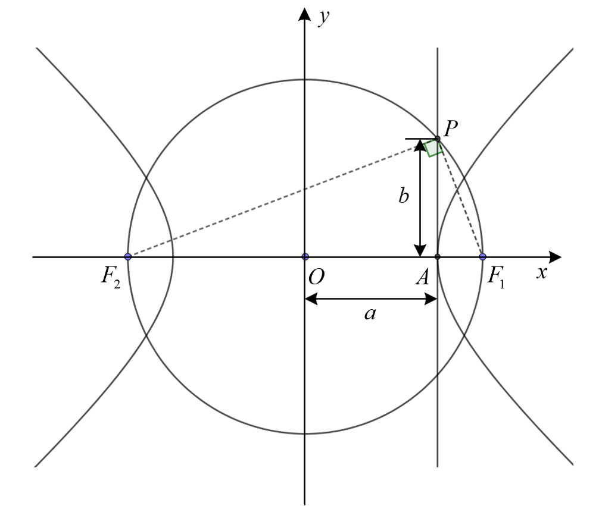
$$
{b^2} = (c - a)(c + a) = {c^2} - {a^2}
$$
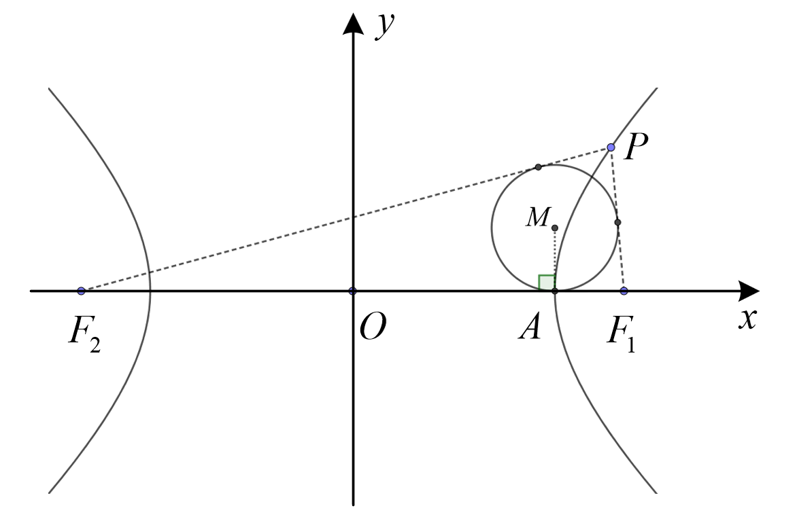
$$
\Delta P{F_1}{F_2}的内切圆M切x轴于顶点A
$$

$$
S_\Delta P{F_1}{F_2}    = \frac{  {b^2}  }{ \tan \frac{ \angle {F_1}P{F_2}  }{2} }
$$

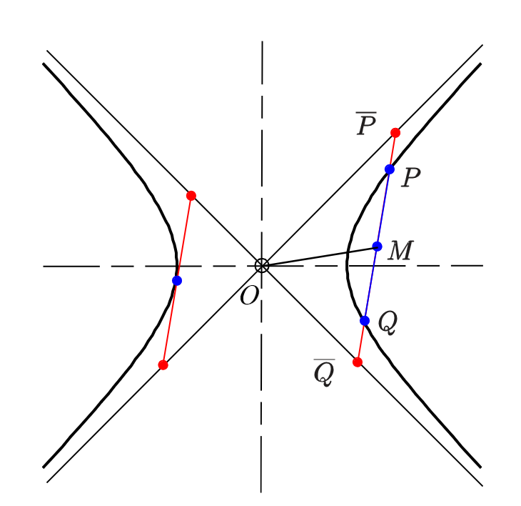
$$
|P\overline P | = |Q\overline Q |,{k_{OM} } \cdot {k_{PQ } } = \frac{ { {b^2} } }{ { {a^2} } }\\\left\{ {\begin{array}{*{20}{l} }
  {x = \frac{a}{ {\cos t} } = a\sec t,} \\ 
  {y =  \pm b\tan t} 
\end{array} } \right.
$$

## 抛物线

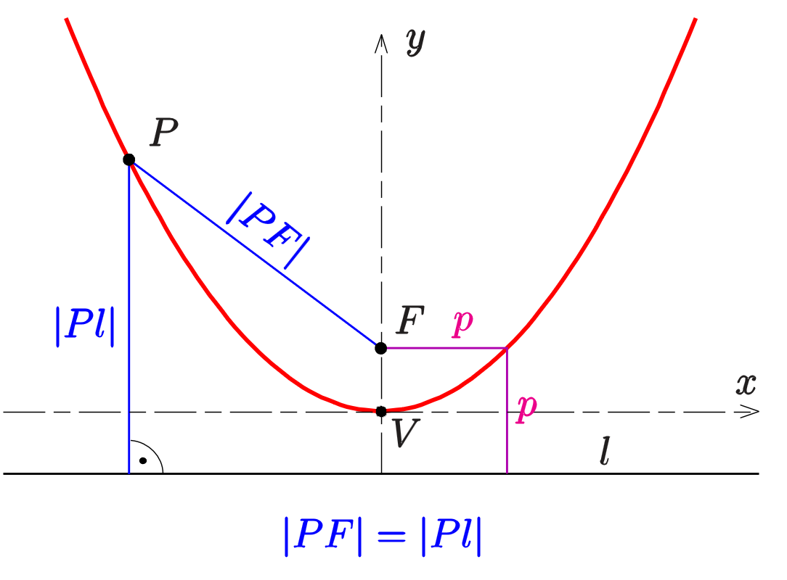
$$
\left\{ {\begin{array}{*{20}{l} }
  { {y^2} = 2px,(x为对称轴)} \\ 
  { {x^2} = 2py,(y为对称轴)} 
\end{array}  } \right.
$$

$$
|PF|=|Pl|
$$

### 焦点弦

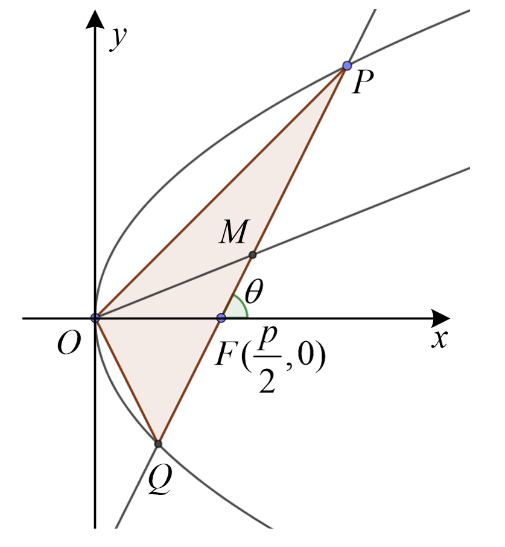
$$
\left\{ \begin{gathered}
  \left| {FP} \right| = \frac{p}{ {1 - \cos \theta } } \hfill \\
  \left| {FQ} \right| = \frac{p}{ {1 + \cos \theta } } \hfill \\ 
\end{gathered}  \right. \Rightarrow \left| {PQ} \right| = \frac{ {2p}  }{ { { {\sin }^2}\theta } }
$$

$$
{S_{\Delta PFQ}  } = \frac{ { {p^2}  }  }{ {2\sin \theta } }
$$

$$
\left\{ \begin{gathered}
  {x_p} \cdot {x_Q} = \frac{ { {p^2}  }  }{4} \hfill \\
  {y_P} \cdot {y_Q} =  - {p^2} \hfill \\ 
\end{gathered}  \right.
$$

$$
\frac{1}{ {\left| {FP} \right|} } + \frac{1}{ {\left| {FQ} \right|} } = \frac{2}{p}
$$

$$
{k_{PQ}  } \cdot {y_M} = p
$$

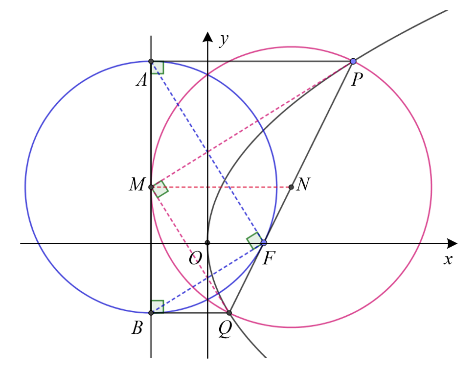
$$
\begin{gathered}
  MN = NP = NQ \hfill \\
  AM = AN \hfill \\
  \left\{ \begin{gathered}
  \left| {PF} \right| = \left| {AP} \right| = {x_P} + \frac{p}{2} \hfill \\
  \left| {QF} \right| = \left| {BQ} \right| = {x_Q} + \frac{p}{2} \hfill \\ 
\end{gathered}  \right. \hfill \\ 
\end{gathered}
$$

$$
MP,MQ为切线
$$

### 参数方程

$$
\left\{ \begin{gathered}
  x = 2p{t^2} \hfill \\
  y = 2pt \hfill \\ 
\end{gathered}  \right.
$$

## 切线

$$
\frac {x^2} {a^2}\pm \frac {y^2} {b^2}=1\\
\frac{ {2{x_0}  }  }{ { {a^2}  }  } + \frac{ {2{y_0}  }  }{ { {b^2}  }  } \cdot \frac{ { {\text{d}  }y}  }{ { {\text{d}  }x}  } = 0 \Rightarrow \frac{ { {\text{d}  }y}  }{ { {\text{d}  }x}  } =  - \frac{ { {b^2}{x_0}  }  }{ { {a^2}{y_0}  }  }
$$

切线方程为
$$
\frac{  {x_0}x }{ {a^2}    } + \frac{  {y_0}y  }{  {b^2}    } = 1
$$
$$
y=kx\pm\sqrt{a^2k^2+b^2}
$$

抛物线
$$
\begin{gathered}
  {y^2} = 2px \hfill \\
  2{y_0} \cdot \frac{ { {\text{d}  }y}  }{ { {\text{d}  }x}  } = 2p \Rightarrow \frac{ { {\text{d}  }y}  }{ { {\text{d}  }x}  } = \frac{p}{ { {y_0}  }  } \hfill \\ 
\end{gathered}
$$

双曲线
$$
\frac{  {x_0}x }{ {a^2}    } - \frac{  {y_0}y  }{  {b^2}    } = 1
$$

$$
k=\frac{ { {b^2}{x_0}  }  }{ { {a^2}{y_0}  }  }\Rightarrow x_0=\frac{ak}{\sqrt{k^2-1}}
$$

$$
y=kx\pm\sqrt{a^2k^2-b^2}
$$

$$
\frac{  {x_0}x }{ {a^2}    } \pm \frac{  {y_0}y  }{  {b^2}    } = 1\\
y=kx\pm\sqrt{a^2k^2\pm b^2}
$$

椭圆切线
$$
y=kx\pm\sqrt{a^2k^2+ b^2}
$$
双曲线切线
$$
y=kx\pm\sqrt{a^2k^2- b^2}\textcolor{red} {(|k| > \frac{b}{a} )}
$$
不包括斜率不存在时

$P({x_0},{y_0})$在切线上，解出$k$
$$
{y_0} - k{x_0} =  \pm \sqrt {a^2k^2 - b^2}\\
({x_0}^2 - {a^2}){k^2} - 2{x_0}{y_0}k + ({y_0}^2 - {b^2}) = 0
$$
若$k^2$前系数为$0$，则为一次方程，有一条斜率存在的切线，还有一条不存在的切线

 

若$k^2$前的系数不为$0$，则该方程是一个关于$k$的一元二次方程，可能有$0$个，$1$个，$2$个解

$$
\begin{array}{l}
\Delta &= 4x_0y_0 - 4(x_0^2 - a^2)(y_0^2 + b^2)\\
&=4{a^2}{b^2}\left[\textcolor{red}{ 1 - \left(\frac{x_0^2}{a^2} - \frac{y_0^2}{b^2} \right)}\right]
\end{array}
$$

若$\frac{x_0^2}{a^2} - \frac{y_0^2}{b^2}=0$，有一根为$k=\frac{b}{a}/ - \frac{b}{a}$，故舍去

​                                                                                                      