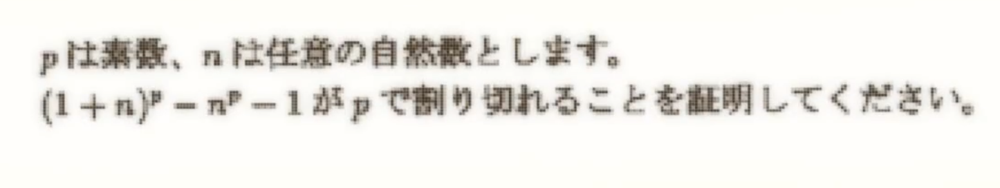

# 趣题

## 组合数学

> 魔法少女小圆第十话

$$
(1+n)^p-n^p-1\;\;\text{mod}\;\;p\equiv 0\quad p为素数
$$

$$
C_p^0+
\underbrace {C_p^1n^1+C_p^2n^2+\cdots+C_p^{p-1}n^{p-1}}
_{有p这个因子}
+C_p^pn^p-n^p-1\;\;\text{mod}\;\;p\equiv 0
$$

