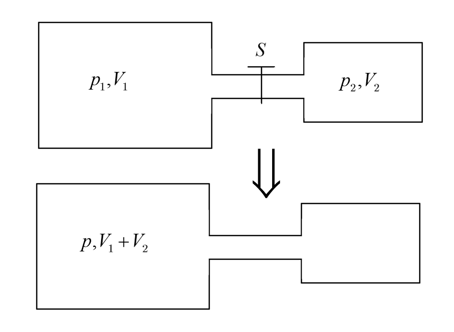

# 热学

$$
m_{\text{partical}}\overset {N_A} \longleftrightarrow m_{\text{mol}}\overset{n}{\longleftrightarrow}m
$$

$$
\begin{gathered}
   \hfill \\
  \left\{ \begin{gathered}
  {p_1}{V_1} = {p_2}{V_2} \hfill \\
  pV = C \hfill \\ 
\end{gathered}  \right. \hfill \\ 
\end{gathered}
$$

$$
\begin{array}{|c|c|}
\hline   &p&V\\
\hline 原& p_1V_{1}+p_2V_{2}&\backslash \\
\hline 后&p&V_1+V_2\\
\hline
\end{array}
$$

$$
p_1V_1+p_2V_2=p(V _1+V_2)
$$

$$
\frac{4}{3}\pi {r^3} = \frac{1}{6}\pi {d^3} = \frac{m}{n \cdot {N_A} \cdot \rho } \Rightarrow d = \sqrt[3]{\frac{6m}{n{N_A}\pi \rho }}
$$

$$
\left\{ \begin{gathered}
  solid \to V = \frac{ m_{partical}  } {\rho } = \frac{m} { n\rho {N_A} }  \hfill \\
  gas \to V = \frac{ m_{partical}  } {\rho }(\frac{m} { n\rho {N_A}  } = distance) \hfill \\ 
\end{gathered}  \right.
$$

$$
S_Ap_A+p_0S_B=mg\sin\theta+S_Bp_B+p_0S_A
$$

## 打气问题

$$
\sum\limits_{i = 1}^n {\frac{p_iV_i}{T_i}}  = \frac{pV}{T}=nR
$$

$$
p_0V_0+p_0\triangle V =p_1V_0\\
p_1V_0+p_0\triangle V=p_2V_0\\
\cdots\\
p_{n-1}V_0+p_0\triangle V=p_nV_0
\\\Rightarrow p_n=\left(1+\frac{n\triangle V}{V_0}\right)p_0
$$

## 抽气问题

$$
p_0V_0=p_1(V_0+\triangle V)\\
p_1V_0=p_2(V_0+\triangle V)\\
\cdots\\
p_{n-1}V_0=p_n(V_0+\triangle V)\\
\Rightarrow p_n=\left(\frac{\triangle V}{\triangle V+V_0}\right)^np_0
$$

$$
mg\sin \theta  - \mu (Eq + mg\cos \theta ) = ma
$$

