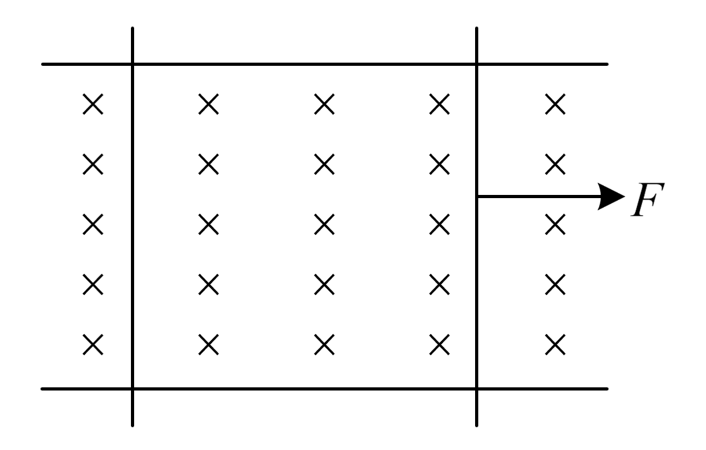
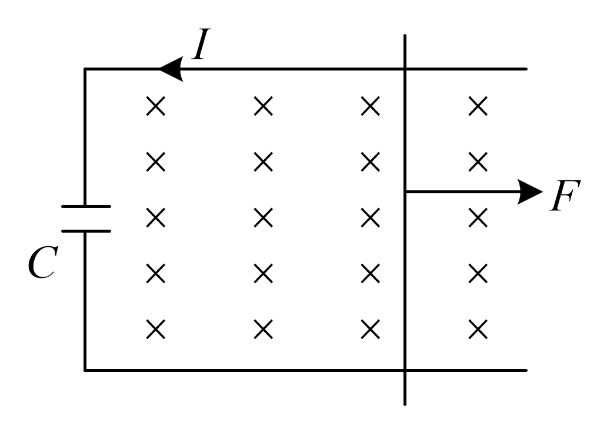
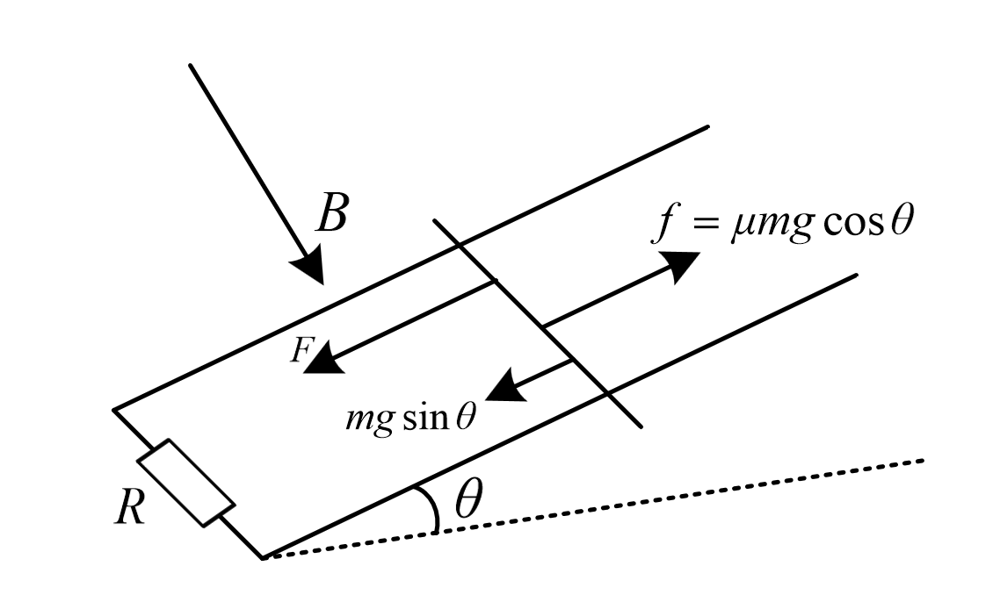

# 电磁学

$$
F=qvB\sin \theta
$$

$$
mv_0=m(v_1+v_2)
$$

$$
F=Blv\sin\theta
$$

$$
F-\frac{B^2L^2(v_1-v_2)}{R}=ma_1\\
\frac{B^2L^2(v_1-v_2)}{R}=ma_2
$$

$$
E=\frac{\triangle \varphi }{\triangle t}=\frac{\triangle B }{\triangle t}S+B'lv=\frac12B\omega r^2=Blv
$$

## 有外力电容

$$
\\\left \{ \begin{array}{l}I=\frac{\triangle q}{\triangle t}\\ \triangle q=C\triangle U\\\triangle U=Bl\triangle v\\ a=\frac{\triangle v}{\triangle t} \end{array}\right.\Rightarrow I=BlCa\\
ma=F-BIl=F-B^2L^2Ca\Rightarrow a=\frac{F}{m-B^2L^2C}\triangle
$$

$$
无外力电容\\E=\frac QC=BLv\Rightarrow v=\frac{Q}{BLC}
\\BIL\triangle t=mv-mv_0=BLQ
$$

$$
对于u=U_m\sin(\omega t)\\
U=\frac{U_m}{\sqrt{2}}\\Q=\frac{U^2}{R}T=\sum_{i=1}^n\frac{U_i}{R}t_i
$$

## 经典分析

$$
F\triangle x-mg\sin\theta\triangle x-k\triangle x-\mu mg\cos\theta\triangle x-Q=\frac12mv_1^2-\frac12mv_0^2
$$

$$
F\triangle t-mg\sin\theta\triangle t-\mu mg\cos\theta\triangle t-BLq(or\quad\frac{B^2L^2\triangle x}{R+r})=mv_1-mv_0
$$

$$
\frac{B^2L^2v}{R+r}=mg\sin\theta+\mu mg\cos\theta
$$

