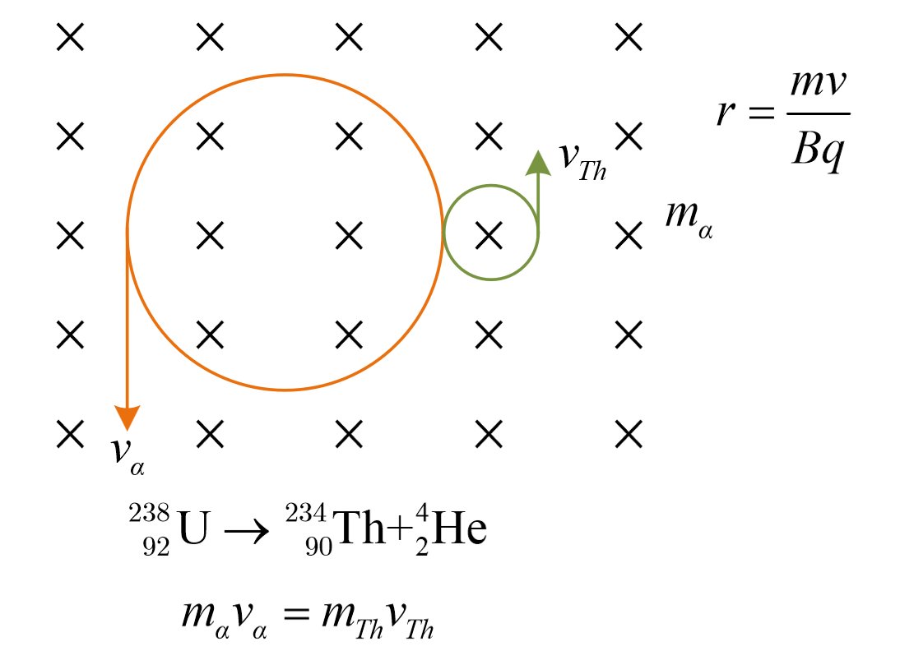

# 近代物理

$$
\textrm{Photoelectri   Effect}\\\begin{cases}E_{k_0}=h\nu -W_0=U_ce
\\E_{k_1}=E_{k_0}+U_{正}e\\E_{光强}=nh\nu \\W_0=h\nu _c(截止频率)
\end{cases}
$$

$$
\begin{cases} E_{pn}=-k\frac{e^2}{r_n} \\E_{kn}=k\frac{e^2}{2r_n} \end{cases}\Longrightarrow E_n=E_{pn}+E_{kn}=-k\frac{e^2}{2r_n}
$$

$$
\tilde{\nu}=\frac1\lambda=R(\frac{1}{2^2}-\frac{1}{n^2})\quad n=3,4,5,\cdots
$$

$$
E_n=\frac{1}{n^2}E_1\quad (E_1=-13.6\text{eV})\;\;r_n=n^2r_1
$$

$$
r=\frac{mv}{Bq}\\
m_\alpha v_\alpha=m_{Th}v_{Th}
$$

$$
\begin{cases} E=h\nu \\p=\frac{h}{\lambda}\end{cases} \triangle p\cdot\triangle x\ge\frac{h}{4\pi}
$$
$$
\rm\alpha 衰变\\ 2 _{1}^{1}H +2 _{0}^{1}n \rightarrow _{2}^{4}He \\  _{92}^{238}U  \rightarrow_{90}^{234}Th +_{2}^{4}He\\\rm \beta衰变\\_{0}^{1}n  \rightarrow  _{1}^{1}H +_{-1}^{0}e\\ _{90}^{234}Th  \rightarrow _{91}^{234}Pa + _{-1}^{0}e
\\+\beta衰变\\_{1}^{1}H  \rightarrow  _{0}^{1}n +_{1}^{0}e\\ _{15}^{30}P \rightarrow _{14}^{30}Si + _{1}^{0}e
$$

$$
人工转变\\ \begin{cases}\rm
_{2}^{4}He+ _{7}^{14}N \rightarrow _{8}^{17}O + _{1}^{1}H(Rutherford)\\\rm
_{2}^{4}He+ _{4}^{8}Be \rightarrow _{6}^{11}C + _{0}^{1}n(Chadwick)\\\rm
_{2}^{4}He+ _{13}^{27}Al \rightarrow _{15}^{30}P + _{0}^{1}n 
\\\rm _{15}^{30}P \rightarrow _{14}^{30}Si + _{1}^{0}e(I. Joliot-Curie)
\end{cases}
$$

