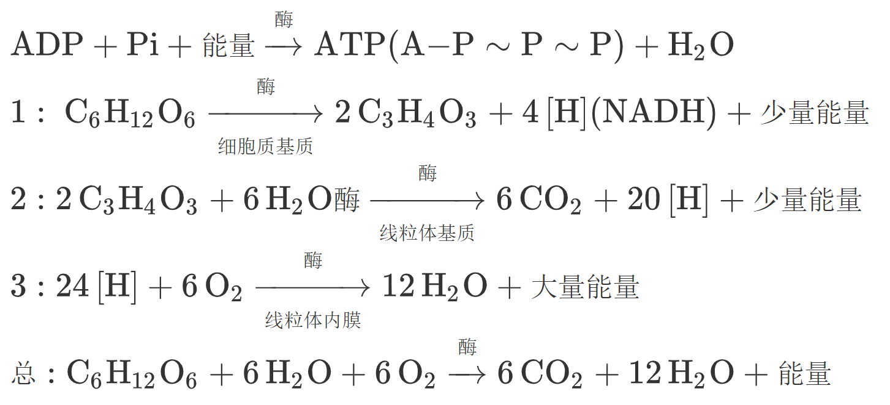
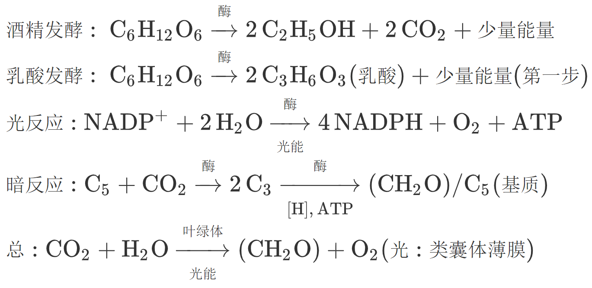

遗传题(基因型,比例,形状)以下可逆推

看是什么遗传方式常,细胞质,$\rm XY$,$\rm ZW$

明确性状:常$\left\{ \begin{gathered}
  {\text{Ts:}同株} \hfill \\
  {\text{ts:}雌株} \hfill \\ 
\end{gathered}  \right.,\text{X}\left\{ \begin{gathered}
  {\text{A:}黑} \hfill \\
  {\text{a:}白} \hfill \\ 
\end{gathered}  \right.$

看这几对是否遵循自由组合(可乘)

看特殊比,找出基因与性状的关联

$2:1:5 \Rightarrow 2:(1 + 5) = 2 \times (1:3)$

$(3:1) = {(1:1)^2},(9:7) = {(3:1)^2}$

了解特殊致死异常不育等条件

通过乘法加法原理，配子法计算

