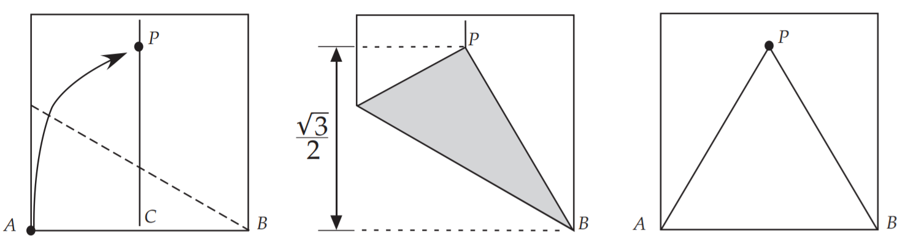
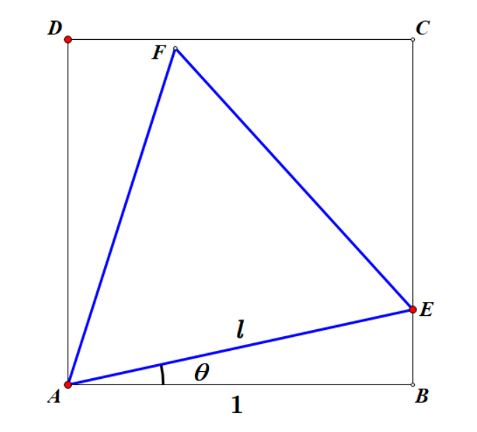
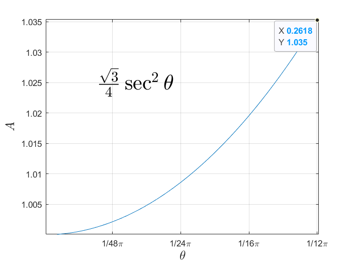

# 1.在正方形中折出等边三角形

要折等边三角形，首先要折出$60{\circ}$的角，以下是最容易的一种方法

如何让三角形最大呢

- 如果等边三角形的三个顶点没有落在正方形的四条边上，那么可以放大三角形让它落在边上
- 如果有顶点落在边上，可以平移，旋转该三角形，使其某一顶点落在正方形的任意顶点上

所以我们只需要研究某一个顶点和正方形的顶点重合的等边三角形

画出图形，由几何关系，三角形的边长$l$可以用$\theta$表达
$
l=1 / \cos \theta=\sec \theta
$
故面积$S$为
$
S(\theta)=\frac{\sqrt{3}}{4} \sec ^{2} \theta
$
根据对称性，我们只需要考虑$0^{\circ} \leq \theta \leq 15^{\circ}$的情况

因为$\cos \theta $在$0^{\circ} \leq \theta \leq 15^{\circ}$单调递减

所以$\sec\theta=\frac{1}{ {\cos \theta } }$在$0^{\circ} \leq \theta \leq 15^{\circ}$单调递增

或对面积求导
$
\frac{\mathrm{d}S}{\mathrm{d} \theta } =2\cdot \frac{\sqrt{3}}{4} \cdot \frac{1}{\cos\theta  } \cdot -\frac{1}{\cos ^{2} \theta}\cdot
-\sin \theta  =\frac{\sqrt[]{3}\sin \theta  }{2\cos^{3} \theta }
$
当$\theta=15^{\circ}$时有最大值

故此时$l=\sqrt{6}-\sqrt{2}=1.035$

或者用几何方法分析
$\begin{array}{l}l &=\sqrt{AB^2+BE^2} \\&=\sqrt{1+BE^2}\end{array}$
当$BE$最大时边长有最大值

$\therefore\begin{array}{l}S &=\frac12l^2\sin60^\circ \\&=\frac{\sqrt{3}}{4}\times(\frac{AB}{\cos15^\circ})^2\end{array}\\$

由半角公式得

$\begin{array}{l}\sin15^\circ &=\sqrt{\frac{1-\sin30^\circ}{2}}\\&=\frac12\sqrt{2-\sqrt3} \\&=\frac12\sqrt{(\frac{\sqrt6}{2})^2-2\cdot\frac{\sqrt6}{2}\cdot\frac{\sqrt2}{2}+(\frac{\sqrt2}{2})^2} \\&=\frac12\sqrt{(\frac{\sqrt6}{2}-\frac{\sqrt2}{2})^2} \\&=\frac{\sqrt6-\sqrt2}{4}\end{array}$

$\begin{array}{l}\cos15^\circ &=\sqrt{\frac{1+\cos30^\circ}{2}} \\&=\frac{\sqrt6+\sqrt2}{4}\end{array}$

或使用两角和与差公式$\sin(\theta\pm\phi)=\sin\theta\cos\phi\pm\cos\theta\sin\phi$有

$\begin{array}{l}\sin15^\circ &=\sin(60^\circ-45^\circ)\\&=\sin60^\circ\cos45^\circ-\cos60^\circ\sin45^\circ\\&=\frac{\sqrt6-\sqrt2}{4}\end{array}$

$\begin{array}{l}\cos15^\circ &=\sqrt{1-\sin15^\circ} \\&=\frac{\sqrt6+\sqrt2}{4}\end{array}$

故$S=\frac{\sqrt{3}}{4}(\frac{4}{\sqrt6+\sqrt2})^2=2\sqrt3-3$

