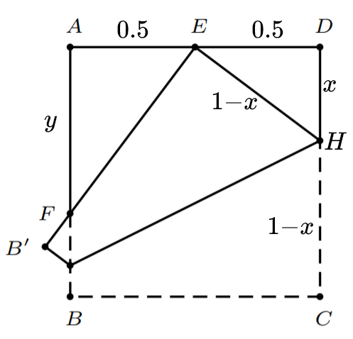
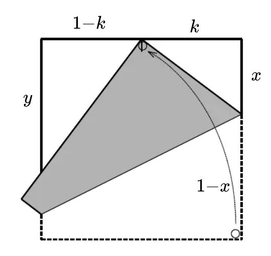
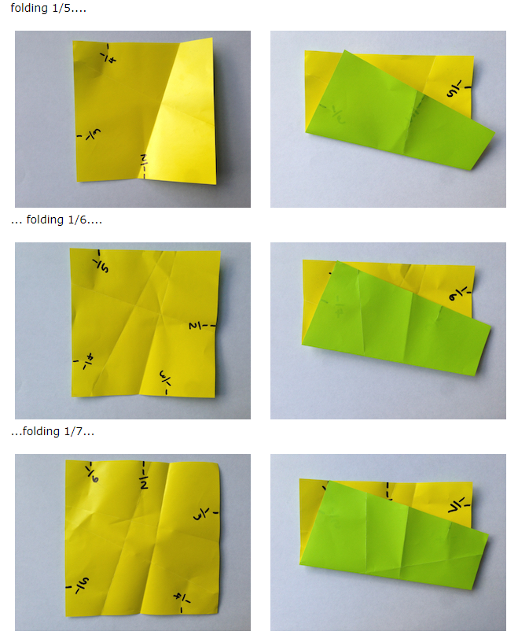
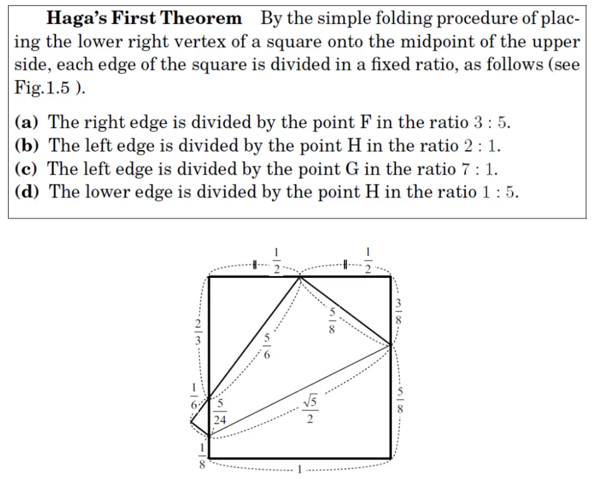
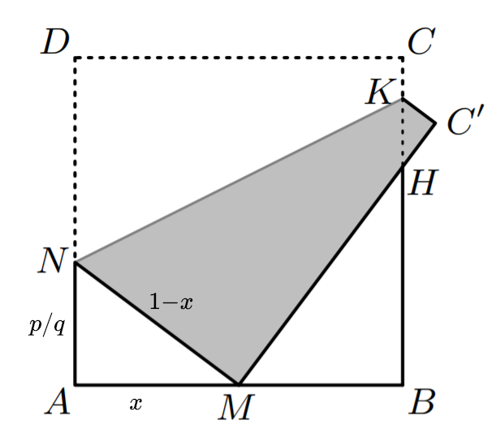
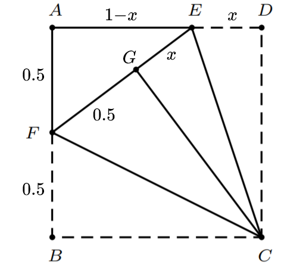
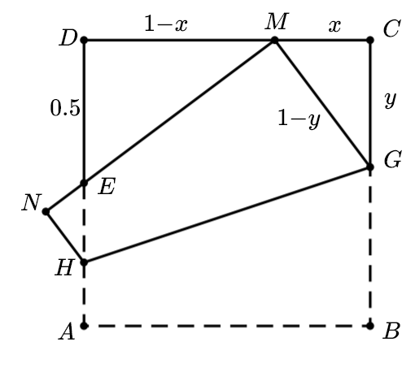
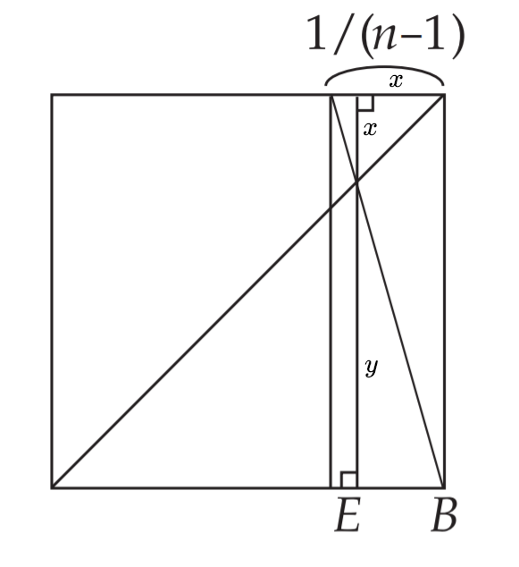

## 1.芳贺第一定理

日本筑波大学生物学教授芳贺和夫（Kazuo Haga），在等待实 验结果的时候喜欢用摺纸打发时间。他发现了以下的有趣结果。

$Claim:F$为$AB$的三等分点

$proof:$

设正方形边长为1，将$C$折到$AD$的中点$E$处，由图
$$
x^{2}+\left(\frac{1}{2}\right)^{2}=(1-x)^{2}
$$
解得$x=\frac{3}{8}$

又$\triangle FAR \sim \triangle EDH$
$$
\frac{y}{\frac{1}{2}}=\frac{\frac{1}{2}}{x}
$$
解得$y=\frac{2}{3}$

$Property:$

### 推广：

$$
x^{2}+k^{2}=(1-x)^{2}
$$

$$
\frac{y}{1-k}=\frac{k}{x}
$$

通过相似三角形和勾股定理，联立两个方程
$$
\frac{y}{1-k}=\frac{k}{\left(1-k^{2}\right) / 2}
$$

$$
\frac{y}{2}=\frac{k}{1+k}
$$

若正方形边长为1，有$k=\frac{1}{N}$，带入得到
$$
\frac{y}{2}=\frac{1 / N}{1+1 / N}=\frac{1}{N+1}
$$

如果一直按此方法重复，就可以由$n$等分得到$n+1$等分，于是便得到了任意等分 ~~有点麻烦~~

注意左上角的直角三角形，它是一个$3:4:5$的直角三角形，难道这只是巧合吗

$A B=1, A N=x  $及$A M=\frac{p}{q}  $其 中 $p, q \in \mathbb{N},  M N=1-x $
$$
\begin{aligned}
\left(\frac{p}{q}\right)^{2}+x^{2} &=(1-x)^{2} \\
\frac{p^{2}}{q^{2}}+x^{2} &=1-2 x+x^{2} \\
x &=\frac{q^{2}-p^{2}}{2 q^{2}}
\end{aligned}
$$
所以，
$$
\begin{aligned}
A N: A M: M N &=\frac{q^{2}-p^{2}}{2 q^{2}}: \frac{p}{q}: 1-\frac{q^{2}-p^{2}}{2 q^{2}} \\
&=q^{2}-p^{2}: 2 p q: p^{2}+q^{2}
\end{aligned}
$$
所以只要$p$和$q$是整数，那么这三条边的比就一定是勾股数
$$
\begin{array}{|l|l|}
\hline p / q & A N: A M: M N \\
\hline 1 / 2 & 3: 4: 5 \\
\hline 2 / 3 & 5: 12: 13 \\
\hline 1 / 4 & 15: 8: 17 \\
\hline
\end{array}
$$

## 2.芳贺第二定理

将$AB$沿$CF$折叠，延长$FG$交$AD$于$E$

在$\triangle AEF$中，有
$$
(1-x)^{2}+(\frac{1}{2})^{2}=(x+\frac{1}{2})^2
$$
解得$x=\frac{1}{3}$，即$E$是$AD$的三等分点

## 3.芳贺第三定理

设正方形 $ABCD$的边长为1,$ C M$=$x$, $C G$=$y$

将$AB$边折到$AD$中点$E$上，并让$B$点落在$CD$上

由  $\triangle E D M \sim \triangle C M G$,  可得
$$
\frac{D E}{D M}=\frac{C M}{C G}
$$
在$\triangle  C M G$  中, $G M$$=$$1-CG=1-y$，有
$$
x^{2}+y^{2}=(1-y)^{2}
$$
解之得
$$
y=\frac{1-x^{2}}{2}
$$
带入得$x=\frac{1}{3}$，即点$M$是$  C D  $的三等分点.

## 4.再谈n等分

 如果我们得到了$n-1$等分，在图中不难看出
$$
\frac{\frac{1}{n-1}}{1}=\frac{x}{y}
$$
消去$y$可以得到$x=\frac{1}{n}$

这样我们又有一种n等分的方式

$tip:$如果要得到7等分，我们可以先折3等分再对折，从而由6等分得到7等分

### References:

1. https://plus.maths.org/content/folding-numbers
2. https://www.bilibili.com/read/cv5270753/